- [Выбор IDE](#выбор-ide)
- [Установка инструментов](#установка-инструментов)
  - [Установка .NET](#установка-net)
  - [Установка Visual Studio](#установка-visual-studio)
  - [Установка Rider](#установка-rider)
  - [Установка Visual Studio Code](#установка-visual-studio-code)
- [Создание первой программы](#создание-первой-программы)
  - [Visual Studio](#visual-studio)
  - [Rider](#rider)
  - [VS Code](#vs-code)
- [Запрет на top-level file](#запрет-на-top-level-file)

# Выбор IDE

IDE (integrated development environment) - среда разработки со множеством инструментов, помогающих разработчикам быстрее и качественнее писать программы. Конечно, всегда можно пользоваться любым текстовым редактором, но это будет не очень эффективно.

Например, в IDE есть средства подсказок (IntelliSense), которые говорят, какие есть доступные текстовые команды, инструменты для пошаговой отладки написанной программы для поиска ошибок и очень много чего еще. Поэтому существует множество различных IDE для каждого языка программирования, чтобы сделать процесс разработки удобным и быстрым.

Для языка C# основными IDE (имхо) являются:
* **Visual Studio** (VS) - заточена конкретно под C#, требует минимальной настройки, но много весит и для работы в ней требуется более "сильное" железо
* **JetBrains Rider** (Rider) - ничем не уступает VS ни по удобству, ни по требованию к железу. Имеет немного другой интерфейс, характерный для всех продуктов JetBrains.
* **Visual Studio Code** (VS Code) - по сути это универсальный редактор для различных языков программирования, гораздо более легковесный по сравнению с VS и Rider, но расплата за это - многие вещи вам придется делать руками: создавать проекты, настраивать отладку и т.д.

Если у вас нормальный, не древний, рассыпающийся комп и у вас не было опыта работы с какой-либо IDE от JetBrains, то выбирайте Visual Studio. Если вы уже привыкли к JetBrains, то берите Rider.

Но если у вас есть проблемы с железом и у вас комп еле жив, то вам придется выбрать VS Code. Это будет не очень приятно, но выбора-то все равно нет. Если даже VS Code ваш комп не потянет, то придется какое-то время пользоваться онлайн-компиляторами в веб браузере, но рано или поздно придется задуматься о новом компе.

# Установка инструментов

Если вы выбрали Rider или VS Code, то сначала понадобится самостоятельно установить .NET SDK - набор инструментов для разработки программ на платформе .NET. Для Visual Studio можно выбрать .NET SDK для установки прямо внутри инсталлятора, поэтому отдельно ставить не понадобится.

## Установка .NET
Скачиваем инсталлятор отсюда: [Download .NET](https://dotnet.microsoft.com/en-us/download) и устанавливаем.

## Установка Visual Studio
[Качаем Visual Studio Installer](https://visualstudio.microsoft.com/ru/vs/community/) и открываем скачанный файл. Откроется единый инсталлятор для всего, что нужно для Visual Studio.

На вкладке "Доступно" находим Visual Studio Community 2022 - последную доступную версию VS на момент написания данного гайда. Обратите внимание, что нужна Community версия - бесплатная версия, с которой не нужны доп действия по активации, взлому и т.д.

Нажимаем "Установить"

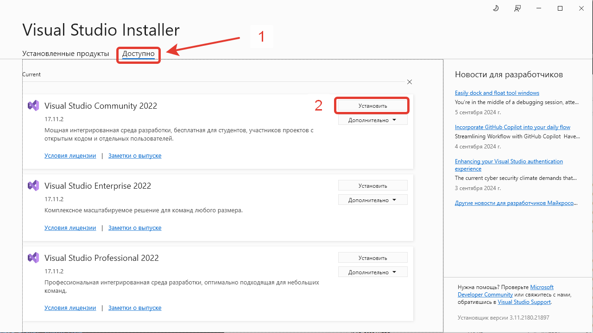

Откроется окно с выбором требуемых компонентов для установки. В VS можно разрабатывать множество различных типов программ. Далеко не все вам понадобятся сразу или когда-либо и для экономии места на диске можно выбрать только то, что нужно в данный момент. В дальнейшем можно будет добавить/удалить компоненты, зайдя в этот же инсталлятор и выбрав вариант "Изменить" у уже установленной Visual Studio.

В данный момент нам понадобится набор "Разработка классических приложений .NET", в котором есть собственно сам .NET последней версии, консольные и десктоп приложения. 

Если вам захочется поставить что-то еще, например, веб приложения или С++ приложения, то выбирайте то, что хотите поставить. Внизу у кнопки "Установить" вы увидите сколько места на диске потребуется для установки всего этого добра. У меня установлено больше компонентов, чем вам нужно, поэтому не обращайте внимание на мои цифры.

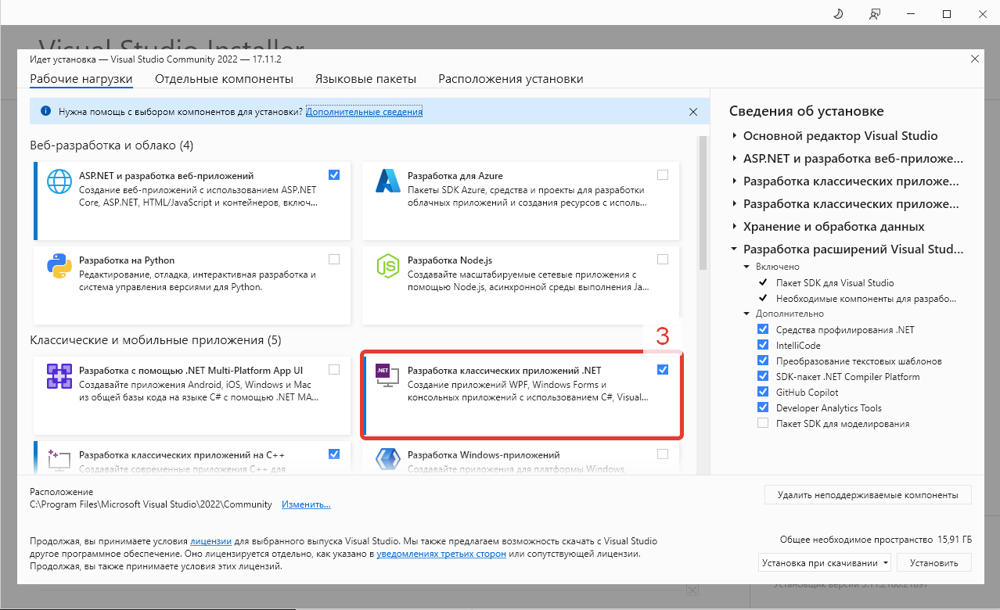

Также настоятельно рекомендую дополнительно поставить английский язык.

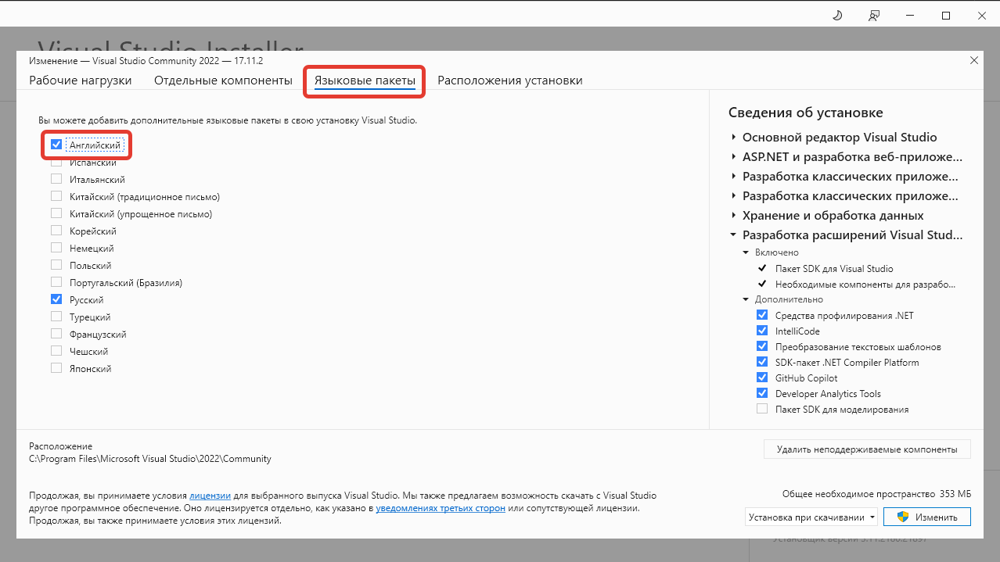

После того, как выбрали все, что нужно, нажимайте на кнопку "Установить" и ждите окончания установки.

## Установка Rider

У Rider нет Community (бесплатной) версии, но можно бесконечно пользоваться триалом, сбрасывая его каждый месяц. Для этого сообщество уже создало [скрипты](https://gist.github.com/rjescobar/4b7200d7b2274c029107ca8b9d02f3a3) или уже готовые [программы](https://github.com/XGilmar/JetBrains-reset-trial-app).

Обращу внимание, что с официального сайта скачать инсталлятор получится только через всем известные технологии скрытия своей страны присутствия. JetBrains прекратил предоставление своего ПО в России.

Или найти альтернативную ссылку для скачивания.

Скачиваем с [официального сайта](https://www.jetbrains.com/ru-ru/rider/download) или [моего Google Drive](https://drive.google.com/drive/folders/1kNwf7ZyI4R3rbhWt9ybI6P8QC0Uia-b6?usp=sharing). Ставим триальную версию.

## Установка Visual Studio Code

Тут все просто. VS Code бесплатный, опенсорсный, поэтому просто [качаем](https://code.visualstudio.com/download) и ставим.

# Создание первой программы

Во время пар по умолчанию я буду показывать все примеры для Visual Studio. Но по необходимости и вашей просьбе я могу переключиться на любую IDE, чтобы помочь в вашем индивидуальном случае.

Также все мои IDE идут с английской локализацией. Во время пар я буду стараться пояснять перевод инструментов на русском, но настоятельно советую привыкать именно к английским названиям. 

Связано это с тем, что англоязычное сообщество будет всегда больше, чем русскоязычное, просто потому что английский все еще остается международным языком и единственный способ контактировать людям из разных стран - это говорить на английском. Если искать ответ на вопрос на английском вы найдете ответ с большей вероятностью, чем на русском. Если пытаться переводить с русского на анлийский какие-то названия и термины, вы можете не угадать с переводом и не найдете нужный ответ. Если же сразу использовать английский, то вы точно не ошибетесь с термином.

Смиритесь. Английский это must have в IT.

## Visual Studio

При первом запуске, появится приветственное окно. Вас попросят залогиниться, создать учетку Microsoft или скипнуть этот шаг. После этого у вас спросят про базовые настройки. Можете ничего не менять и пройти дальше или поменять на свой вкус цветовую схему.

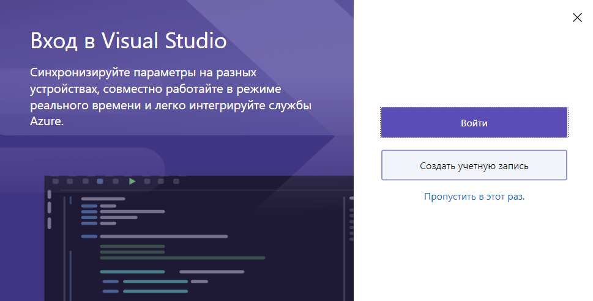

Далее откроется окно, которое в дальнейшем и будет первым открываться при запуске VS. Это окно со списком недавно открывавшихся проектов (при вашем первом запуске будет пусто) и возможность создать новый проект. Нажимает "create a new project"

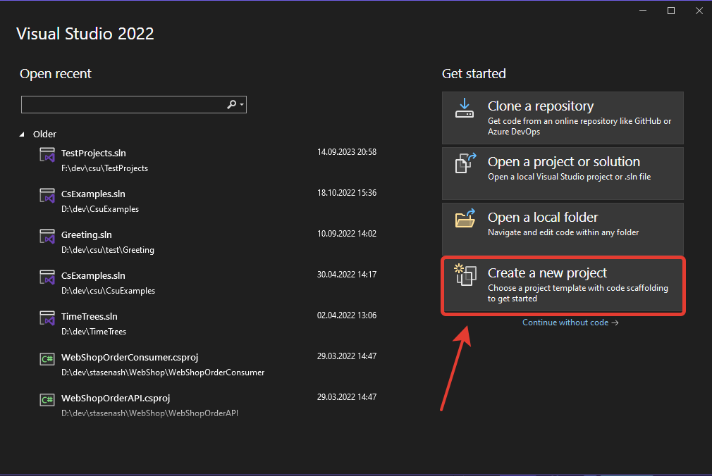

Нужно выбрать тип проекта, который нужен. Вы достаточное долгое время будете создавать только консольные приложения. Поэтому ищем тип "Console App". Чтобы отфильтровать доступные варианты можно воспользоваться выпадающими списками, отфильтровать язык C# и тип приложения - Console. Нажимаем "Далее".

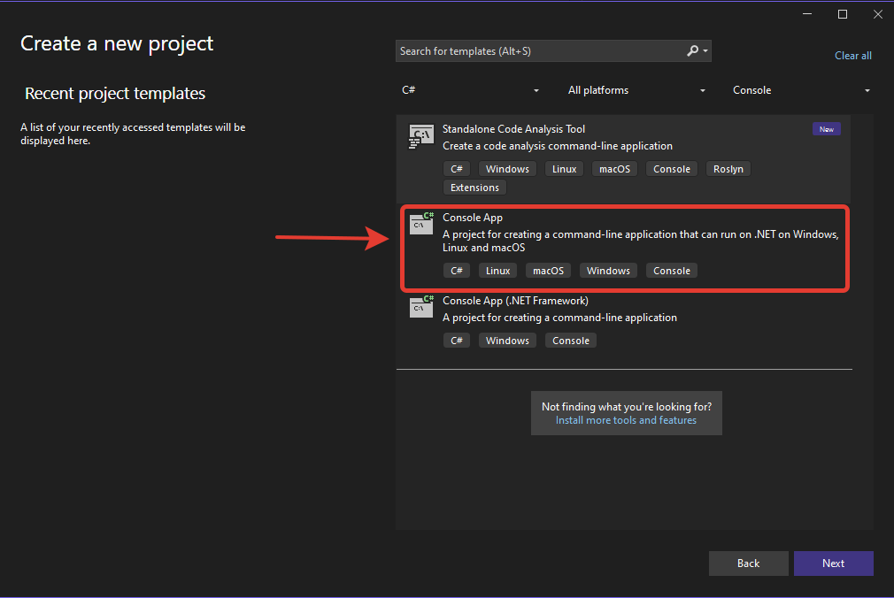

Задайте осмысленное имя проекта на английском языке и путь до папки, где вы хотите хранить ваши проекты. Я предпочитаю создавать для этого отдельное пространство, но по умолчанию визуалка предложит вам место внутри "Документов". Снова нажимаем "Далее".

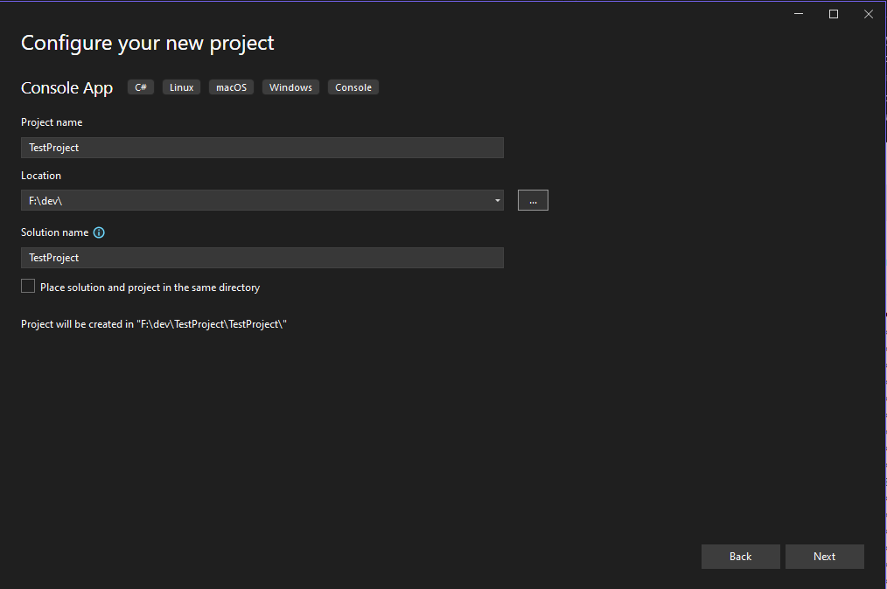

Проект создан. VS открывает окно редактора, в котором можно будет в дальнейшем писать код. Справа будет Solution Explorer, где в виде дерева будет видна структура вашего проекта со всеми подключенными файлами.

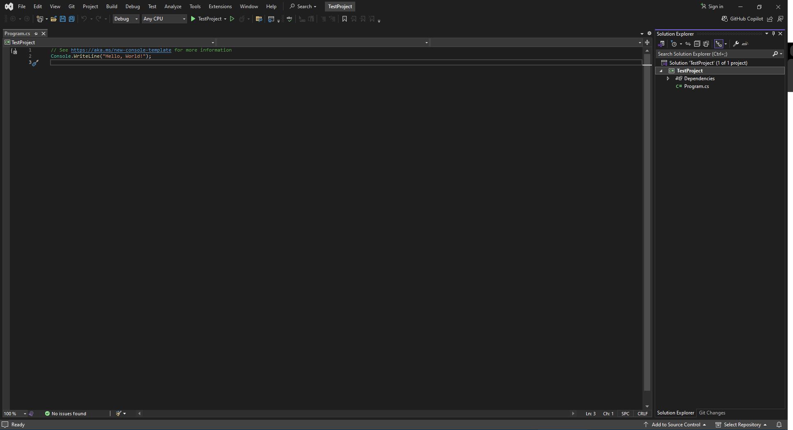

Для запуска программы нужно нажать на зеленый треугольник вверху.

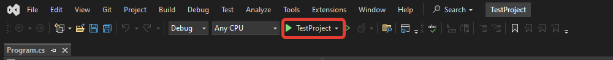

Запустится консоль, а в ней сообщение, которое выводилось в коде.

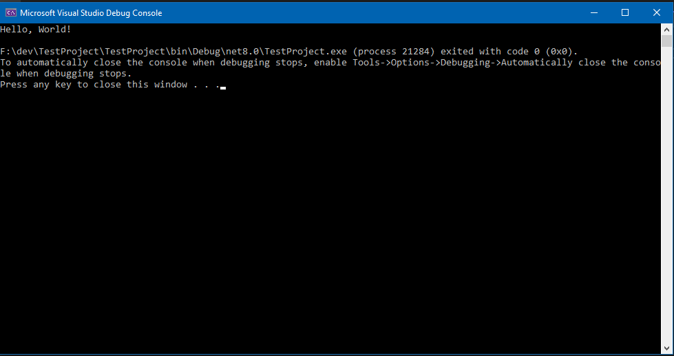

Если по какой-то причине приветственное окно с созданием нового проекта у вас не появилось и вы оказались в пустом окне Visual Studio, всегда можно запустить создание проекта вручную через меню `File`.

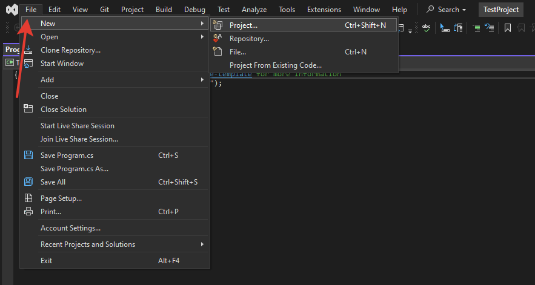

## Rider
При самом первом запуске Rider попросит выбрать начальные настройки. Если хотите, можете поменять под себя, например, цветую тему, или оставить все настройки без изменений и прокликать вперед до экрана с проектами.

При старте Rider открывается экран с недавно открывавшимися проектами. При первом запуске он будет пустой. Также на этой экране будет кнопка "New Solution" для создания нового проекта. Кликаем ее.

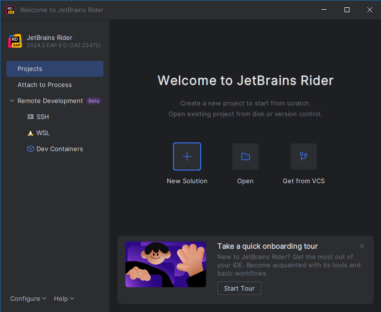

Откроется меню создания проекта. Нам нужен тип Console, выбираем его слева. Справа вписываем название проекта в Solution и Project name. Пусть они совпадают. Далее будем разбирать в чем между ними разница.

Задайте осмысленное имя проекта на английском языке и путь до папки, где вы хотите хранить ваши проекты. Я предпочитаю создавать для этого отдельное пространство, но по умолчанию это будет где-то внутри "Документов". Нажимаем "Далее".

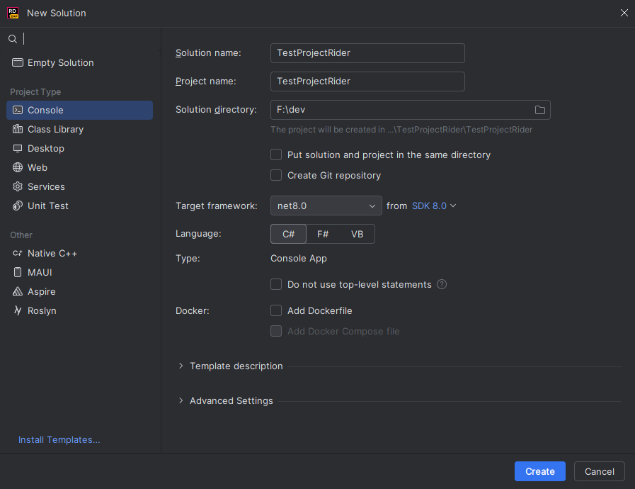

Проект создан. Откроется окно редактора, в котором можно будет в дальнейшем писать код. Слева будет Solution Explorer, где в виде дерева будет видна структура вашего проекта со всеми подключенными файлами.

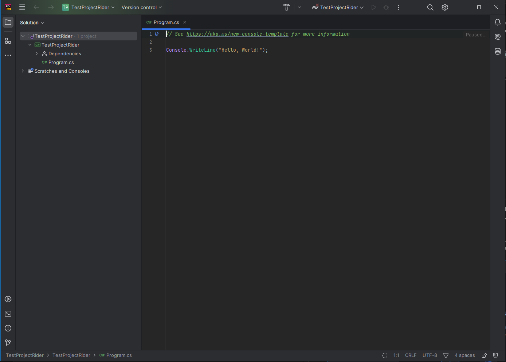

Для запуска программы нужно нажать на зеленый треугольник вверху.

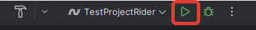

Запустится консоль, а в ней сообщение, которое выводилось в коде.

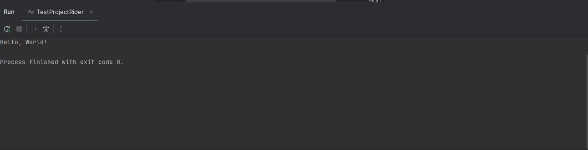

По умолчанию Rider выводит программу в свой встроенный терминал, а не в отдельное окно с консолью. Это поведение можно поменять, изменив настройки запуска.

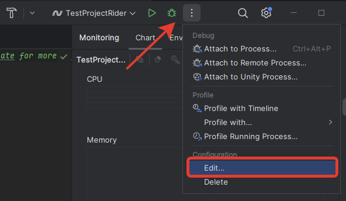

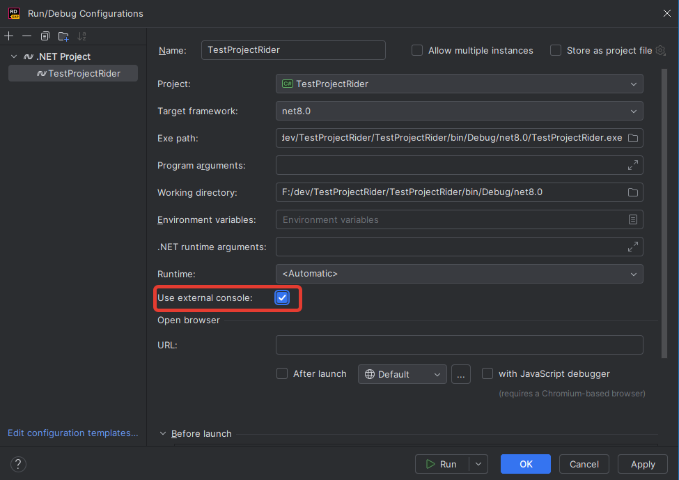

Если по какой-то причине приветственное окно с созданием нового проекта у вас не появилось и вы оказались внутри Rider без проекта, всегда можно запустить создание проекта вручную через меню `File`.

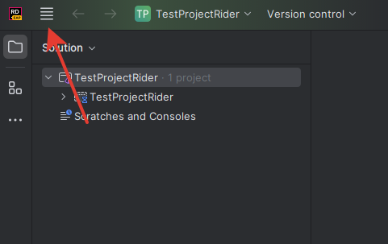


## VS Code

Сначала в любом удобном вам месте в файловой системе создайте отдельную папку, в которой будет создаваться проект с программой. Дайте папке осознанное название, например, TestProject.

Далее откройте VS Code и выберите `File -> Open Folder`. 

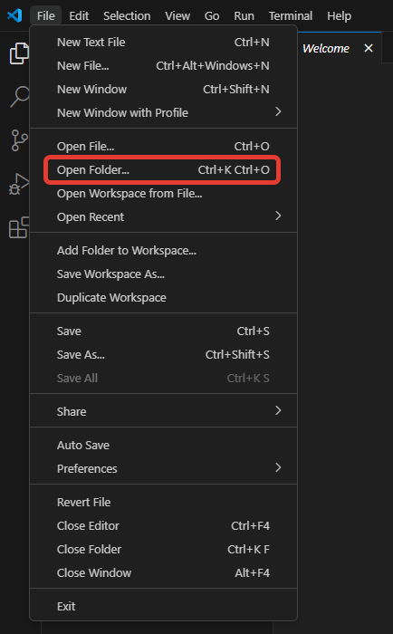

В открывшемся окне найдите созданную вами папку для проекта.

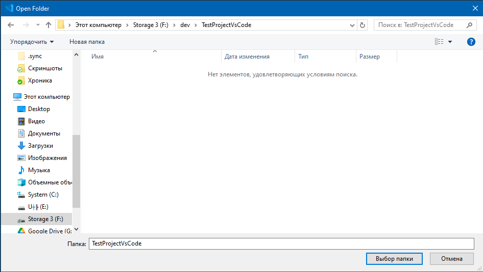

VS Code загрузит папку, но она пустая, поэтому по сути ничего не изменится. Пока что. Нужно открыть терминал. `View -> Open Terminal`

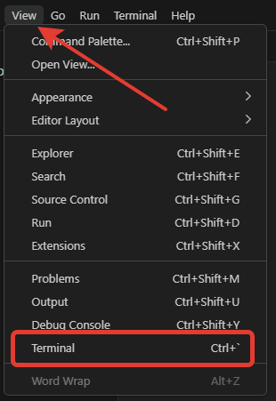

Терминал откроется в панели внизу. Вводим в терминал команду для создания проекта и нажимаем Enter.

```
dotnet new console --framework net8.0 --use-program-main
```
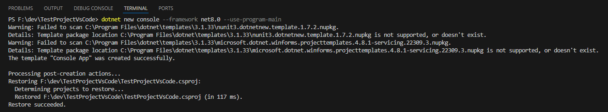

После выполнения команды в терминале, создадутся файлы проекта. VS Code покажет их в Explorer в панели слева.

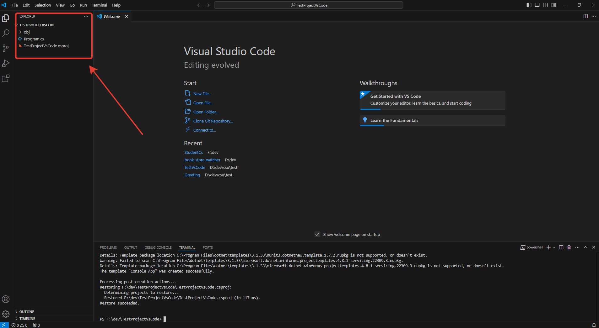

Если открыть файл `Program.cs`, то там будет текст программы.

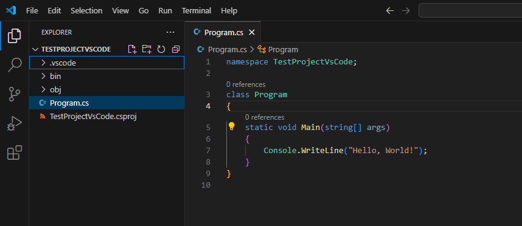

Для запуска программы сначала нужно создать конфигурацию запуска. Меню `Run -> Add Configuration`

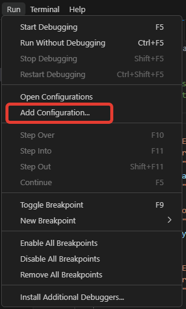

Появится список доступных конфигураций. Нам подойдет `.NET 5+ and .NET Core`. Выбираем его.

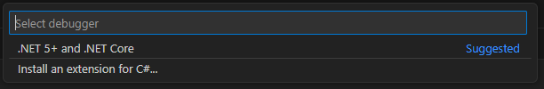

Во-первых, создастся папка с именем `.vscode`, в которой хранятся файлы с настройками проекта в рамках VS Code. Во-вторых, в папке создадутся файлы с конфигурациями запуска программы. В них можно задавать значения параметров, чтобы менять поведение запуска программы. Например, выбрать встроенную в VS Code консоль или внешнюю и т.д.

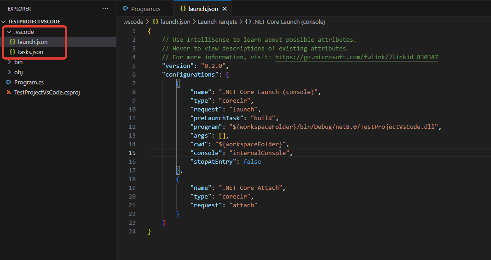

Теперь программу можно запустить через меню `Run -> Run Without Debugging`. Программа скомпилируется, затем откроется панелька с консолью, в которую выведется текст программы.

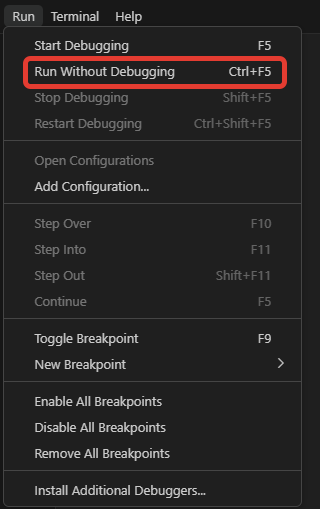

Еще можно запускать программу через отдельную панель для дебага. Переключить панель можно слева. Там будет зеленый треугольник для запуска.

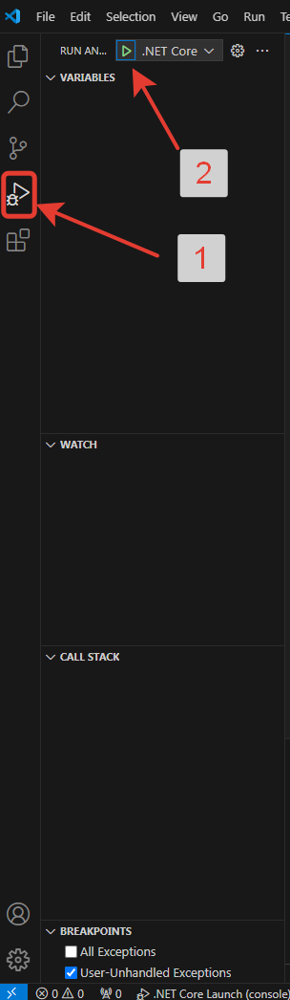

# Запрет на top-level file

В C# может быть только одна точка запуска программы. По умолчанию, она выглядит так:

```cs
namespace TestProjectVsCode;

class Program
{
    static void Main(string[] args)
    {
        Console.WriteLine("Hello, World!");
    }
}

```

Есть класс с каким-то именем (исторически это имя `Program`, но может быть любым другим), внутри у него статический метод `Main` - это фиксированное имя, которое нельзя менять.

И этот метод `Main` и есть точка запуска программы. Она может быть только одна.

Начиная с C# 9 появилась возможность в файле с точкой запуска программы использовать так называемые `top level statements`, а файл их использующий стали называть `top level file`. Как можно понять такой файл во всем проекте может быть только один, ни в каких других файлах это использовать нельзя.

И таким образом файл с точкой запуска стало можно записывать так:

```cs
Console.WriteLine("Hello, World!");
```

При такой записи класс и метод `Main` внутри него генерируются в фоне, также как и объявление пространства имен (`namespace` в первой строчке).

Для чего это вообще нужно, если это разрешено в одном единственном файле, а в остальных не допускается? А черт их знает. Имхо я думаю, что это придумали для пугливых питонистов, которые пришли попробовать c# и если увидят в программе `Hello, World` что-то длиннее 1-2 строчек кода, то испугаются и убегут.

Я не имею ничего против python, сам на нем пишу. Это отличный язык для своих задач, он прекрасен для экспериментов, быстрого написания скриптов и далее. Но я не понимаю, зачем тащить чисто питонячьи плюшки в язык, который совсем другой с другой архитектурой, просто для "модности".

Мое мнение как преподавателя, что использование `top level file` для начинающих разработчиков C# несет исключительно вред. Поэтому, пользуясь своим правом вето, я запрещаю использование верхне уровневых инструкций и обязую вас всегда использовать полную запись в файле класса `Program` и метода `Main`.

По умолчанию Visual Studio и Rider создают проекты именно с верхнеуровневыми конструкциями. Поэтому всегда после создания файла, вы берете его и переписываете.

В Visual Studio Code можно сразу создать файл бех этих конструкций, если использовать флай `--use-program-main`.