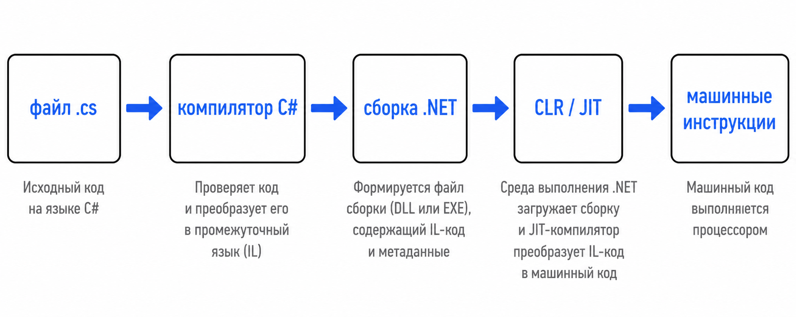
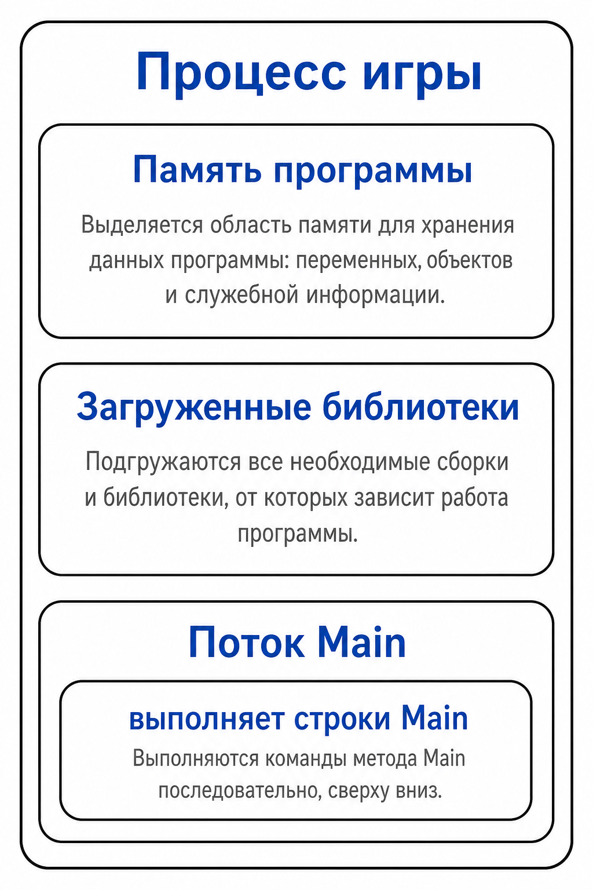
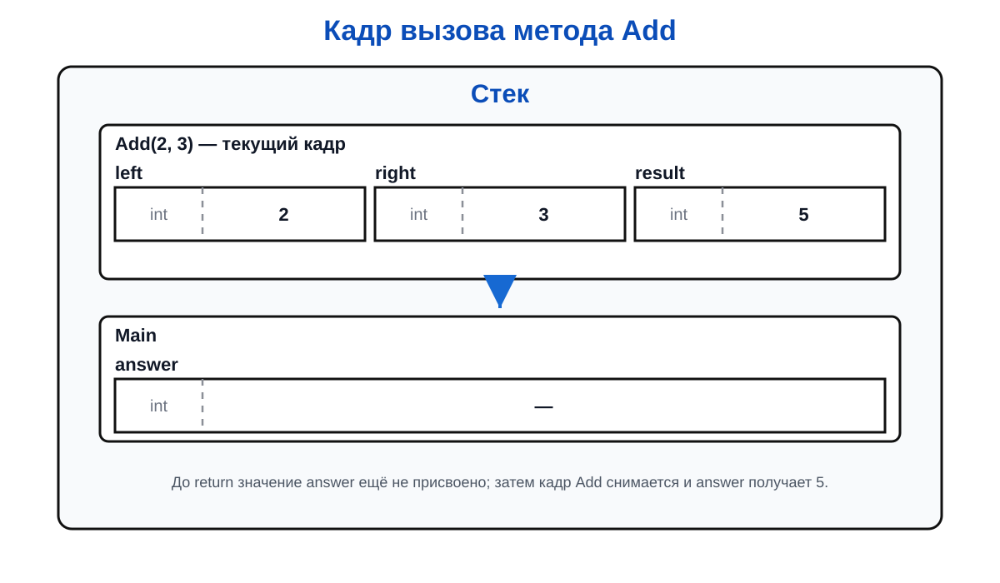
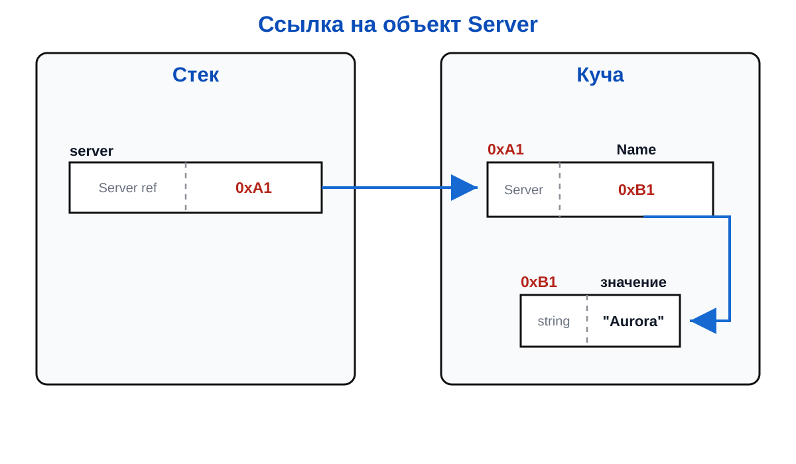

# Лекция 0: как запускается программа на C#

## Исходный код — это не инструкции процессора

Когда мы пишем:

``` csharp
Console.WriteLine("Hello");
```

процессор не получает эту строку напрямую. Сначала исходный код читает компилятор. Он проверяет синтаксис и типы, а затем создаёт промежуточный код .NET — сборку.

Упрощённая цепочка выглядит так:



CLR — среда выполнения .NET. Она загружает сборку, управляет памятью, вызывает сборщик мусора и помогает программе взаимодействовать с операционной системой.

## Процесс и поток

После запуска операционная система создаёт процесс. Процесс получает собственное адресное пространство и ресурсы. Внутри процесса работает как минимум один поток, который выполняет инструкции программы.



Поток — это исполнитель. Память сама по себе ничего не выполняет: она только хранит код и данные, с которыми работает поток.

## Кадр метода в стеке

При вызове метода создаётся кадр вызова. В учебной модели там находятся параметры, локальные переменные и информация, куда вернуться после завершения метода.

``` csharp
static int Add(int left, int right)
{
    int result = left + right;
    return result;
}

int answer = Add(2, 3);
```

Во время выполнения можно представить стек так:



После `return` кадр `Add` снимается. Значение `5` передаётся в `Main`, где записывается в `answer`.

## Куча и объекты

Куча используется для объектов, время жизни которых не обязано совпадать с одним кадром метода.

``` csharp
class Server
{
    public string Name;
}

Server server = new Server { Name = "Aurora" };
```



Переменная `server` обычно содержит ссылку, а сам объект размещён в куче. Когда на объект больше никто не ссылается, сборщик мусора в подходящий момент освобождает его память.

## Важная оговорка о модели

Схема «локальные значения в стеке, объекты в куче» полезна для обучения, но не является обещанием физического устройства каждой программы. JIT-компилятор может держать число в регистре, убрать ненужную переменную или изменить размещение ради оптимизации.

На уровне C# важнее понимать семантику: какие данные копируются, какие переменные содержат ссылки, каков срок жизни объекта и какие операции разрешены типом.

## Итог

Компилятор превращает C# в код, который выполняет CLR. Поток исполняет инструкции, кадры вызовов образуют стек, а объекты обычно живут в куче. Все последующие темы — переменные, методы, массивы и классы — можно рассматривать как разные способы организовать данные и работу с ними.
