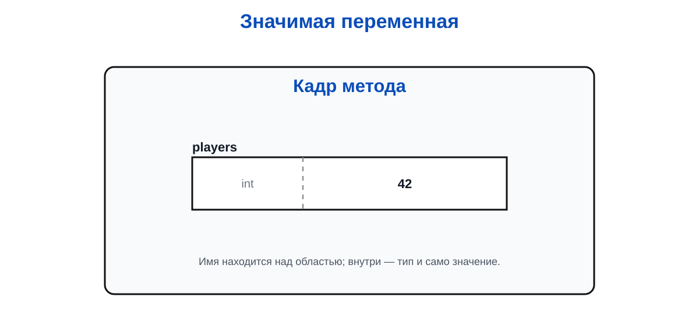
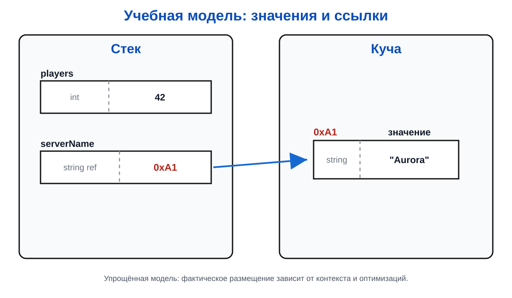
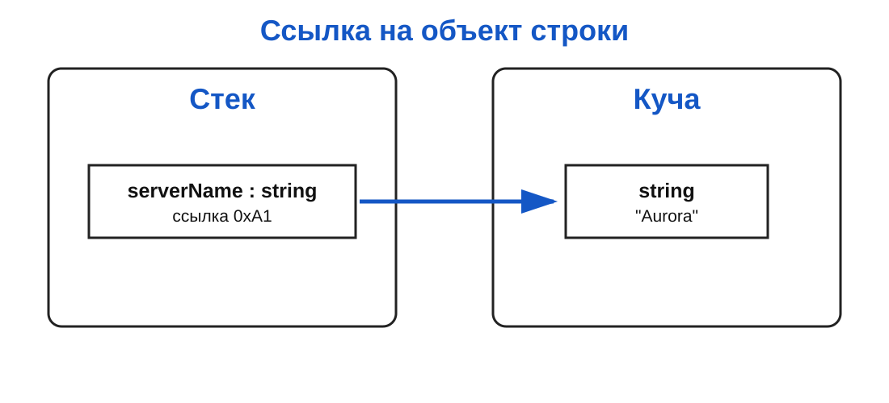
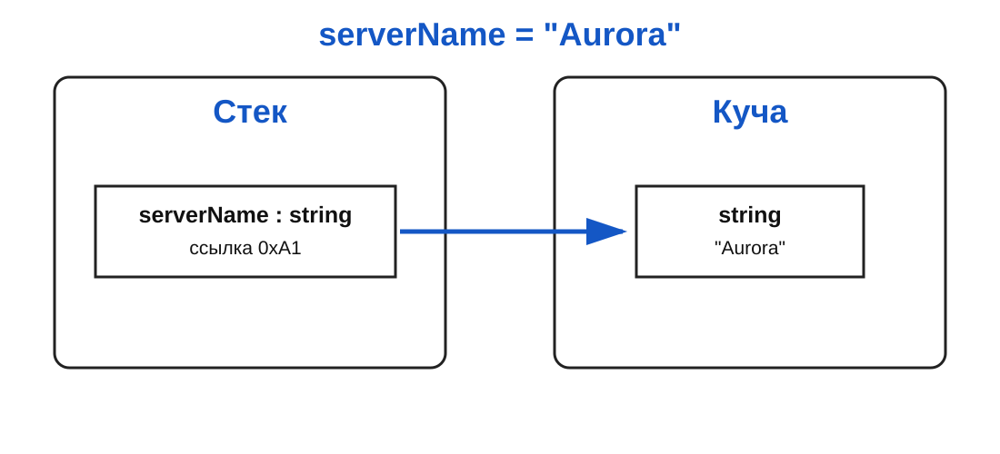

# Лекция 2: типы данных и операторы

## Введение

В первой лекции мы договорились, что переменная хранит значение. Теперь нужно разобраться с важной деталью: какие именно значения она может хранить.

Число игроков на сервере, его загрузка и факт доступности сервера — это разные вещи. Было бы странно хранить всё в одном и том же формате. Для количества игроков подходит целое число, для загрузки — вещественное, а для доступности — логическое значение.

Тип данных сообщает программе, какие значения допустимы и какие операции с ними имеют смысл.

## Что такое переменная

Переменная — это не коробка с надписью внутри компьютера, хотя такая аналогия сначала вполне полезна. Точнее, это имя, связанное с областью памяти, в которой программа хранит значение.

``` csharp
int players = 42;
```

После выполнения этой строки можно представить себе примерно такую картину:



Когда программа встречает `players`, она понимает, где найти связанное с ним значение. Когда выполняется присваивание:

``` csharp
players = 50;
```

старое значение `42` заменяется новым значением `50`. Имя переменной остаётся тем же, меняются данные, которые по этому имени можно получить.

Переменная нужна не только для хранения. Она даёт значениям понятные имена и позволяет использовать результат вычисления несколько раз:

``` csharp
int maxPlayers = 100;
int currentPlayers = 64;
int freeSlots = maxPlayers - currentPlayers;

Console.WriteLine(freeSlots);
```

Без переменных пришлось бы повторять значения прямо внутри формул. Такой код быстро становится нечитаемым и неудобным для изменения.

## Как переменная хранится в памяти

Память компьютера можно представить как очень длинный ряд ячеек. У каждой ячейки есть адрес, а в ячейках лежат нули и единицы. Процессор работает именно с такими данными, а не со словами `players` или `Aurora`.

Когда мы пишем:

``` csharp
int players = 42;
```

компилятор и среда выполнения должны решить несколько задач:

1. выделить место для значения;
2. получить адрес начала этой области памяти;
3. записать туда представление числа `42` в двоичном виде;
4. связать имя `players` с этим адресом;
5. запомнить, что обращаться с данными по этому адресу нужно как с `int`.

Здесь легко сделать важную ошибку в формулировке. Переменная не обязательно хранит адрес самой себя. В примере с `int` область памяти содержит само числовое значение `42`. Имя `players` связано с этой областью, и по имени программа может обратиться к её содержимому. Адрес описывает, где находится область памяти, но не становится значением переменной `int`.

То есть имя `players` — это удобное обозначение, которое позволяет не работать с адресом напрямую. Когда программа встречает это имя, она находит связанную область памяти, читает лежащее там значение и интерпретирует его как `int`.

В реальности распределением памяти занимается .NET, поэтому программист обычно не ищет адрес вручную. Нам достаточно объявить переменную и работать с её именем.

Для локальных переменных часто используют упрощённую модель: простые значения находятся в стеке текущего метода и исчезают, когда метод заканчивает работу. Объекты вроде строк обычно размещаются в управляемой куче, а .NET позже освобождает неиспользуемую память с помощью сборщика мусора.

Это именно упрощённая модель. Компилятор может оптимизировать хранение, а конкретное расположение зависит от контекста. Но для начала важно запомнить основную идею: переменная связывает удобное имя в программе с данными, которые где-то хранятся в памяти.

### Стек и куча на одной схеме

Пока будем использовать такую учебную картинку. Стек рисуем как стопку прямоугольников: новый вызов метода кладётся сверху, а завершившийся вызов снимается сверху. В куче объекты могут располагаться в произвольном порядке.



На схеме `serverName` — это имя переменной, а подпись `string` обозначает её тип. В ячейке показана ссылка на объект строки; это учебная модель, а не буквальное описание физического размещения памяти.

Когда в программе появляется ссылочная переменная, связь можно показать стрелкой от области хранения к объекту:



Стрелка не означает, что `serverName` — это сам текст. Она показывает ссылку на объект, где текст размещён. Для `int players` стрелка к отдельному объекту не нужна: в учебной модели число находится прямо в области переменной.

## На что влияет тип данных

Тип данных влияет как минимум на три вещи:

- сколько памяти требуется для значения;
- какие значения можно хранить;
- как программа должна трактовать набор нулей и единиц.

Например, `int` в .NET занимает 4 байта и предназначен для целых чисел. Он не хранит дробную часть.

`double` обычно занимает 8 байт и умеет представлять очень большие и дробные числа, но делает это приблизительно. Поэтому `double` удобен для загрузки процессора или времени ответа, но не всегда подходит для денег, где важна точная десятичная арифметика.

``` csharp
int players = 64;
double responseTime = 42.7;
```

У этих переменных разные типы, а значит, разный формат хранения и разные допустимые операции. Число `64` можно использовать как количество игроков, а `42.7` — как время ответа. Если попытаться записать дробное значение в `int`, дробная часть будет потеряна при преобразовании.

Логический тип `bool` хранит значение «истина» или «ложь». Внутреннее представление — это деталь реализации, но смысл типа важнее размера: программа знает, что перед ней ответ на логический вопрос, а не произвольное число.

Со строками ситуация интереснее:

``` csharp
string serverName = "Aurora";
```

Переменная `serverName` обычно хранит не весь текст прямо внутри себя, а ссылку на объект строки в управляемой куче. Сам объект содержит символы и дополнительную служебную информацию. Поэтому строка может занимать больше памяти, чем кажется по количеству букв.

Для первых лабораторных достаточно такой модели:



Это отличается от `int`, где переменная содержит само числовое значение. В случае строки переменная обычно содержит ссылку на объект, а сам текст находится в другом месте памяти. Подробное различие между значениями и ссылками мы разберём позже на классах и объектах.

## Почему нельзя хранить всё в одном типе

Представим, что все характеристики сервера мы решили хранить как строки:

``` csharp
string currentPlayers = "64";
string maxPlayers = "100";
```

Для вывода это сработает. Но для вычисления придётся каждый раз преобразовывать строки обратно в числа:

``` csharp
int freeSlots = int.Parse(maxPlayers) - int.Parse(currentPlayers);
```

Если же сразу выбрать подходящие типы, намерение программы видно из объявления, а вычисления становятся естественными:

``` csharp
int currentPlayers = 64;
int maxPlayers = 100;
int freeSlots = maxPlayers - currentPlayers;
```

Правильный тип — это одновременно место в памяти, допустимый диапазон значений и подсказка для компилятора и других программистов.

## Основные типы

``` csharp
int players = 42;
double cpuLoad = 73.5;
bool isOnline = true;
string serverName = "Aurora";
```

Здесь:

- `int` — целые числа;
- `double` — числа с дробной частью;
- `bool` — одно из двух значений: `true` или `false`;
- `string` — текст.

Тип — это не просто подпись рядом с переменной. Он ограничивает допустимые действия и помогает компилятору раньше заметить ошибку.

Например, к количеству игроков можно прибавить одного игрока, а к строке имени сервера такая операция не имеет понятного смысла.

## Целые и вещественные числа

`int` используют там, где дробная часть невозможна или не нужна:

``` csharp
int maxPlayers = 100;
int currentPlayers = 64;
int freeSlots = maxPlayers - currentPlayers;
```

`double` подходит для измерений и показателей, где возможна дробь:

``` csharp
double responseTime = 42.7;
double cpuLoad = 0.735;
```

Не стоит автоматически выбирать `double` для всех чисел. Количество игроков не бывает `64.5`, а время ответа вполне может быть дробным.

## Логический тип

`bool` хранит ответ на вопрос, у которого только два варианта.

``` csharp
bool isOnline = true;

if (isOnline)
{
    Console.WriteLine("Сервер доступен");
}
```

Логические значения особенно полезны в условиях. Вместо неясного числа `1` или строки `"yes"` программа получает точное значение: сервер доступен или нет.

## Арифметические операторы

Для чисел доступны привычные арифметические операции:

``` csharp
int total = 10 + 3;
int difference = 10 - 3;
int product = 10 * 3;
double quotient = 10.0 / 3;
int remainder = 10 % 3;
```

Последний оператор `%` возвращает остаток от деления. Например, `10 % 3` равно `1`.

Остаток часто нужен для практических задач: определить чётность числа, распределить игроков по группам или проверить, закончилась ли пачка предметов.

``` csharp
int playerCount = 11;
bool isEven = playerCount % 2 == 0;
```

В этом выражении сначала вычисляется остаток, а затем он сравнивается с нулём.

## Деление и тип результата

С целыми числами есть маленькая ловушка:

``` csharp
int a = 5;
int b = 2;

Console.WriteLine(a / b); // 2
```

Результат равен `2`, а не `2.5`. Оба операнда имеют тип `int`, поэтому выполняется целочисленное деление, и дробная часть отбрасывается.

Если нужна дробная часть, хотя бы один операнд должен быть вещественным:

``` csharp
Console.WriteLine(5.0 / 2); // 2.5
```

Это особенно важно при вычислении процентов и средней нагрузки сервера.

``` csharp
int currentPlayers = 75;
int maxPlayers = 100;

double usage = currentPlayers * 100.0 / maxPlayers;
Console.WriteLine($"Заполнено: {usage}%");
```

`100.0` здесь выбран специально. Если написать просто `100`, вычисление может остаться целочисленным и потерять дробную часть.

## Преобразование типов

Иногда исходные данные имеют один тип, а вычисление требует другой. Например, ввод из консоли приходит как строка, а для подсчёта свободных мест нужны числа.

``` csharp
int maxPlayers = int.Parse("100");
int currentPlayers = int.Parse("75");

int freeSlots = maxPlayers - currentPlayers;
```

Можно преобразовать `int` в `double`:

``` csharp
int players = 75;
double playersAsNumber = (double)players;
```

Такое явное преобразование называется приведением типа. Мы прямо сообщаем программе: «рассматривай это целое число как вещественное».

Преобразование из более общего типа в более узкий может быть опасным. Например, большое число может не поместиться в `int`, а дробное значение при преобразовании в `int` потеряет дробную часть. Поэтому типы нельзя менять механически — нужно понимать, какие данные мы можем потерять.

## Операторы сравнения

Операторы сравнения возвращают `bool`:

``` csharp
int players = 64;
int limit = 100;

Console.WriteLine(players < limit);  // true
Console.WriteLine(players == limit); // false
```

Основные варианты:

- `==` — равно;
- `!=` — не равно;
- `>` — больше;
- `<` — меньше;
- `>=` — больше или равно;
- `<=` — меньше или равно.

Сравнивать можно и строки, но смысл сравнения нужно выбирать осознанно. Проверка `serverName == "Aurora"` сравнивает текстовые значения, а не «похожесть» названий с точки зрения человека.

## Логические операторы

Несколько условий можно объединять:

``` csharp
bool isOnline = true;
int players = 64;
int limit = 100;

bool canAcceptPlayers = isOnline && players < limit;
```

`&&` означает «и»: оба условия должны быть истинными.

`||` означает «или»:

``` csharp
bool needsAttention = players >= limit || !isOnline;
```

Знак `!` меняет логическое значение на противоположное. В примере сервер требует внимания, если он переполнен или выключен.

## Приоритет операций

Как и в обычной математике, операции выполняются не всегда слева направо.

``` csharp
int result = 2 + 3 * 4; // 14
```

Сначала выполняется умножение, затем сложение. Если порядок важен, используйте скобки:

``` csharp
int result = (2 + 3) * 4; // 20
```

Скобки полезны не только для компьютера, но и для человека, который будет читать код через месяц. Я предпочитаю добавить пару очевидных скобок, чем заставлять читателя вспоминать приоритет операторов.

## Сводка состояния сервера

Теперь можно собрать небольшую модель мониторинга:

``` csharp
string serverName = "Aurora";
int currentPlayers = 75;
int maxPlayers = 100;
bool isOnline = true;
double usage = currentPlayers * 100.0 / maxPlayers;

Console.WriteLine($"Сервер: {serverName}");
Console.WriteLine($"Игроки: {currentPlayers}/{maxPlayers}");
Console.WriteLine($"Загрузка: {usage}%");
Console.WriteLine($"Доступен: {isOnline}");
```

Обратите внимание: каждая переменная отвечает за одну характеристику. Благодаря этому формулы и вывод остаются понятными. Если положить все значения в строки, красивый вывод ещё можно получить, но вычислить загрузку или проверить переполнение станет заметно труднее.

## Итог

Тип данных описывает, какие значения хранит переменная и какие операции с ними возможны.

`int` предназначен для целых чисел, `double` — для вещественных, `bool` — для логики, `string` — для текста.

Арифметические операторы выполняют вычисления, операторы сравнения возвращают `bool`, а `&&`, `||` и `!` помогают объединять условия.

При делении двух `int` дробная часть теряется. Если она нужна, используйте вещественный операнд или явное приведение типа.

Скобки делают порядок вычислений и намерение автора очевидными.

Вторая лабораторная уже похожа на настоящую маленькую утилиту: программа получает факты о сервере, вычисляет показатели и превращает их в сводку. Следующий шаг — научить её принимать решения с помощью ветвлений.
