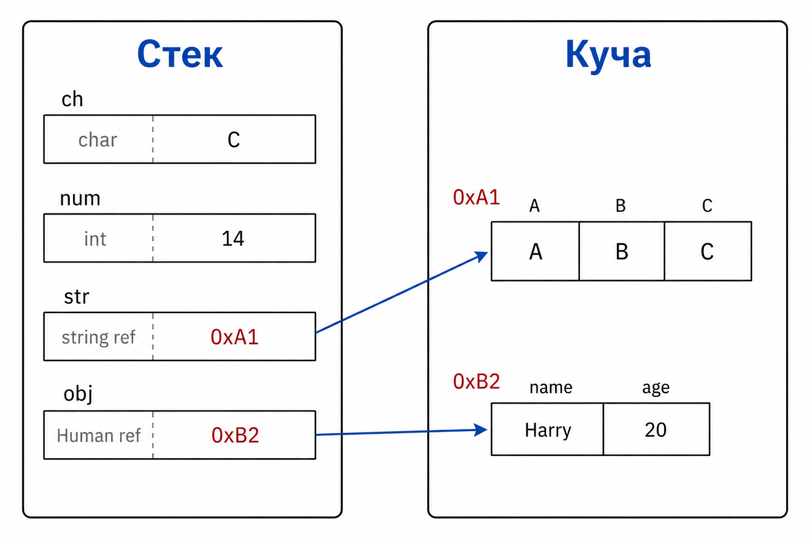

# Лекция 4: методы, строки и `null`

## Методы

Метод — именованный фрагмент программы, который выполняет одну понятную задачу. Он может получать параметры и возвращать результат.

``` csharp
static int GetFreeSlots(int limit, int players)
{
    return limit - players;
}

int freeSlots = GetFreeSlots(100, 64);
Console.WriteLine(freeSlots);
```

Параметры живут в кадре вызова метода. После `return` этот кадр снимается со стека, а возвращённое значение передаётся вызывающему коду.

## Строки

``` csharp
string serverName = "  Aurora  ";
string cleanName = serverName.Trim();

Console.WriteLine(cleanName.ToUpper());
Console.WriteLine(cleanName.Length);
```

`Trim` убирает пробелы, `ToUpper` меняет регистр, `Length` возвращает длину. Строки неизменяемы: методы возвращают новую строку, а не меняют старую.

``` csharp
Console.WriteLine("Имя:\tAurora\nСтатус:\tOnline");
```

`\t` — табуляция, `\n` — новая строка. Такие обозначения называют escape-последовательностями.

Полезно различать методы, которые возвращают новую строку, и свойства, которые сообщают характеристику объекта. Например, `Trim` и `Replace` возвращают текст, а `Length` возвращает число.

``` csharp
string message = "Server: Aurora";
bool containsName = message.Contains("Aurora");
string shortMessage = message.Replace("Server:", "S:");
```

## Дата и время

`DateTime` хранит дату и время. Его можно получить от системы или создать явно.

``` csharp
DateTime startedAt = DateTime.Now;
DateTime releaseDate = new DateTime(2026, 9, 1);

TimeSpan uptime = DateTime.Now - startedAt;
Console.WriteLine(releaseDate.ToString("dd.MM.yyyy"));
Console.WriteLine(uptime.TotalSeconds);
```

`DateTime` — структурный тип: значение даты хранится непосредственно в переменной, а `TimeSpan` описывает промежуток времени. Для серверных программ часто используют `DateTime.UtcNow`, чтобы не зависеть от часового пояса компьютера.

Дату можно форматировать для человека, но для хранения лучше выбирать однозначный формат. Строка `01.02.2026` может быть понята по-разному в разных странах.

## `null`

`null` означает, что ссылочная переменная ни на какой объект не указывает.

``` csharp
string? comment = null;

if (comment == null)
{
    Console.WriteLine("Комментарий отсутствует");
}
```

У `null` нельзя вызвать метод или свойство: сначала нужна проверка. Оператор `?.` позволяет безопасно обратиться к объекту:

``` csharp
int? commentLength = comment?.Length;
```

## Память строк



Строка не меняется на месте. После `Replace` появляются новая строка и новая ссылка; старая строка остаётся неизменной и позже может быть удалена сборщиком мусора.

## Итог

Методы разделяют программу на действия, строки предоставляют операции над текстом, а `null` обозначает отсутствие объекта. В памяти строковая переменная обычно хранит ссылку на объект строки в куче, поэтому при обработке текста могут появляться новые объекты.
