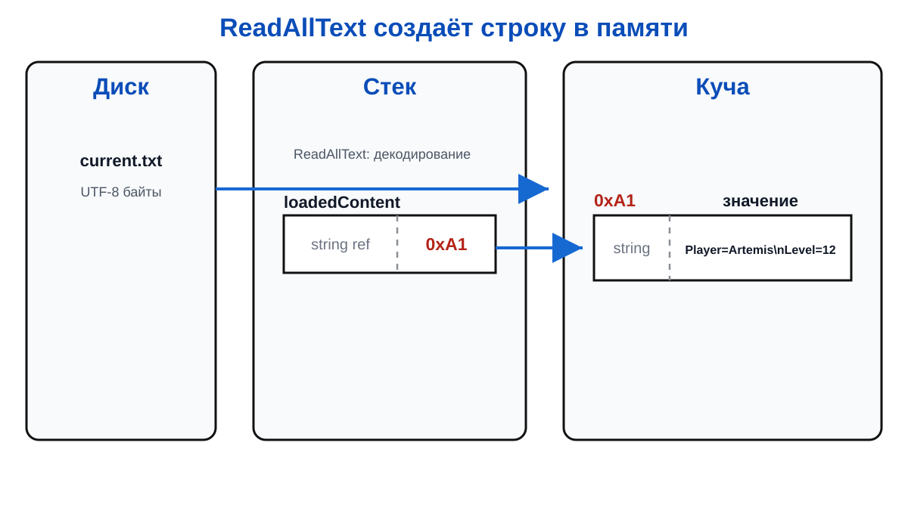

# Лекция 6: файлы, каталоги и кодировка

## Сохранение данных

Переменные исчезают после завершения программы. Файл сохраняет данные между запусками, а каталог организует файлы.

``` csharp
string directory = "saves";
Directory.CreateDirectory(directory);

string path = Path.Combine(directory, "current.txt");
string content = "Player=Artemis\nLevel=12";

File.WriteAllText(path, content, Encoding.UTF8);
string loadedContent = File.ReadAllText(path, Encoding.UTF8);
Console.WriteLine(loadedContent);
```

Файл на диске хранит байты. Кодировка UTF-8 задаёт правило перевода символов в байты и обратно. Если читать файл другой кодировкой, текст может испортиться.

## Память и диск

При чтении .NET получает байты с диска, декодирует их и создаёт объект `string` в куче.



`ReadAllText` загружает весь текст в память. Большие файлы иногда читают частями, чтобы не создавать огромный объект строки.

## Проверка ошибок

``` csharp
string path = "saves/current.txt";

if (File.Exists(path))
{
    string content = File.ReadAllText(path, Encoding.UTF8);
    Console.WriteLine(content);
}
else
{
    Console.WriteLine("Сохранение не найдено");
}
```

Проверка не отменяет исключения: файл может исчезнуть между `Exists` и чтением. В реальной программе опасные операции дополнительно защищают `try/catch`.

## Формат данных

Файл — это только контейнер. Программа должна ещё договориться о формате содержимого. Простую запись строкой приходится разбирать вручную:

``` csharp
string save = "Artemis;12;100";
string[] parts = save.Split(';');
string name = parts[0];
int level = int.Parse(parts[1]);
int health = int.Parse(parts[2]);
```

Если порядок полей изменится или в имени появится `;`, такой формат станет хрупким. Позже для сложных объектов используют сериализацию, но принцип тот же: данные в памяти превращаются в последовательность байтов, а при чтении восстанавливаются обратно.

## Итог

Файл — долговременное хранилище байтов, кодировка связывает байты с текстом, а чтение создаёт объекты в памяти.
