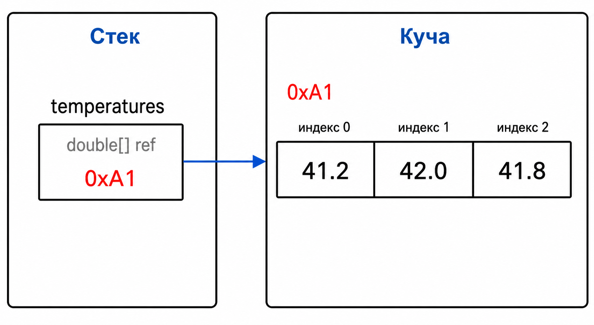

# Лекция 7: массивы и последовательности данных

## Массив

Массив хранит несколько элементов одного типа и обращается к ним по индексам, начиная с нуля.

``` csharp
double[] temperatures = { 41.2, 42.0, 41.8 };
Console.WriteLine(temperatures[0]);
```

Размер массива фиксирован после создания:

``` csharp
int[] players = new int[3];
players[0] = 12;
players[1] = 18;
players[2] = 25;
```

Кроме одномерных массивов бывают прямоугольные многомерные и ступенчатые массивы:

``` csharp
int[,] map = new int[2, 3];
map[0, 1] = 1;

int[][] rows = new int[2][];
rows[0] = new int[2];
rows[1] = new int[4];
```

`int[,]` — один прямоугольный объект с несколькими индексами. `int[][]` — массив ссылок на другие массивы, поэтому строки могут иметь разную длину.

Свойство `Length` сообщает количество элементов одномерного массива. Индекс за пределами диапазона вызывает `IndexOutOfRangeException`.

``` csharp
int[] players = { 12, 18, 25 };

for (int i = 0; i < players.Length; i++)
{
    Console.WriteLine(players[i]);
}
```

Условие `i < players.Length`, а не `i <= players.Length`, оставляет индексы от `0` до `Length - 1`.

Кроме одномерных массивов бывают прямоугольные многомерные и ступенчатые массивы:

``` csharp
int[,] map = new int[2, 3];
map[0, 1] = 1;

int[][] rows = new int[2][];
rows[0] = new int[2];
rows[1] = new int[4];
```

`int[,]` — один прямоугольный объект с несколькими индексами. `int[][]` — массив ссылок на другие массивы, поэтому строки могут иметь разную длину.

## Массив в памяти

Массив — ссылочный тип. Переменная хранит ссылку на объект массива в куче.



Внутри массива `double` лежат сами числа. Массив строк содержал бы ссылки на объекты строк.

## Передача и копирование

``` csharp
static void ChangeFirst(double[] values)
{
    values[0] = 999;
}

double[] values = { 10, 20, 30 };
ChangeFirst(values);
Console.WriteLine(values[0]); // 999
```

Метод получает копию ссылки на тот же массив, поэтому изменение элемента видно снаружи. Для независимой копии нужен отдельный объект:

``` csharp
double[] original = { 10, 20, 30 };
double[] copy = (double[])original.Clone();
```

Оператор `==` сравнивает ссылки, а не содержимое. Для содержимого применяют `SequenceEqual`.

Строки внутри массивов сравниваются по содержимому, потому что `string` переопределяет правила сравнения:

``` csharp
string first = "Aurora";
string second = "Aurora";
Console.WriteLine(first == second); // true
```

Массивы сами остаются ссылочными объектами. Тип элемента и тип контейнера — разные уровни модели памяти.

Строки внутри массивов тоже сравниваются по содержимому, потому что `string` переопределяет правила сравнения:

``` csharp
string first = "Aurora";
string second = "Aurora";
Console.WriteLine(first == second); // true
```

При этом массивы сами по себе остаются ссылочными объектами. Тип элемента и тип контейнера — разные уровни модели памяти.

## Итог

Массив — последовательный объект фиксированного размера. Ссылка на него находится в переменной, элементы — в куче. Нельзя путать копирование ссылки с копированием объекта.
