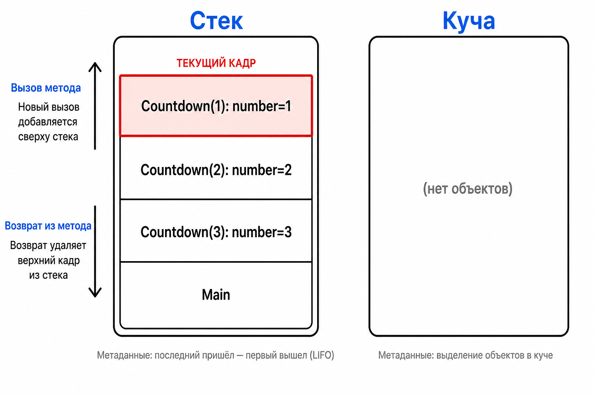

# Лекция 8: рекурсия и отладка

## Рекурсивный метод

Каталог может содержать каталоги внутри себя. Рекурсивный метод решает задачу для текущего элемента и вызывает себя для вложенного элемента.

``` csharp
static void Countdown(int number)
{
    if (number == 0)
    {
        return;
    }

    Console.WriteLine(number);
    Countdown(number - 1);
}
```

У рекурсии обязательно есть базовый случай и шаг, который приближает к нему. Иначе вызовы не остановятся.

## Стек вызовов

Каждый незавершённый вызов получает кадр в стеке. В кадре находятся параметры и локальные переменные конкретного вызова.



Когда вызов завершается, верхний кадр снимается. Слишком глубокая рекурсия исчерпает стек и вызовет `StackOverflowException`.

## Обход дерева каталогов

``` csharp
static void PrintTree(string path, int depth)
{
    string indent = new string(' ', depth * 2);
    Console.WriteLine($"{indent}{Path.GetFileName(path)}");

    if (!Directory.Exists(path))
    {
        return;
    }

    foreach (string childPath in Directory.GetFileSystemEntries(path))
    {
        PrintTree(childPath, depth + 1);
    }
}
```

## Отладка

Точка останова внутри метода позволяет наблюдать `path` и `depth`. Окно Call Stack показывает цепочку незавершённых вызовов, а Locals и Watch — значения в текущем кадре стека.

## Рефакторинг рекурсивного кода

Хороший вариант обхода разделяет вывод текущего элемента, проверку возможности раскрыть его и обработку детей. Не стоит смешивать в одном месте форматирование, поиск каталогов и изменение глубины.

``` csharp
static void PrintTree(string path, int depth)
{
    PrintEntry(path, depth);

    if (!Directory.Exists(path))
    {
        return;
    }

    foreach (string childPath in Directory.GetFileSystemEntries(path))
    {
        PrintTree(childPath, depth + 1);
    }
}

static void PrintEntry(string path, int depth)
{
    string indent = new string(' ', depth * 2);
    Console.WriteLine($"{indent}{Path.GetFileName(path)}");
}
```

После рефакторинга рекурсивный алгоритм остался тем же, но каждую часть можно проверять отдельно.

## Итог

Рекурсия — это повторный вызов метода для меньшей части задачи. Стек хранит незавершённые вызовы, поэтому схема памяти помогает понять и алгоритм, и причину переполнения.
