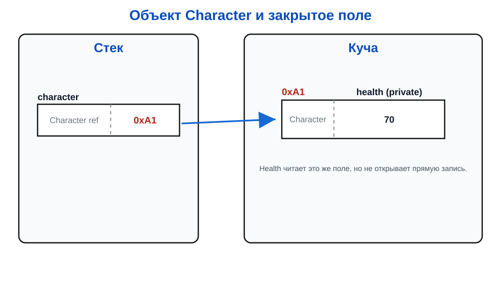

# Лекция 10: инкапсуляция, свойства и исключения

## Проблема открытых полей

Если любой код может записать в здоровье игрока `-500`, объект быстро перестаёт быть персонажем и превращается в набор испорченных чисел.

Инкапсуляция означает, что объект сам защищает своё состояние и предоставляет разрешённые операции.

``` csharp
class Character
{
    private int health;
    public int Health => health;

    public Character(int maxHealth)
    {
        health = maxHealth;
    }

    public void TakeDamage(int damage)
    {
        if (damage < 0)
        {
            throw new ArgumentOutOfRangeException(nameof(damage));
        }

        health = Math.Max(0, health - damage);
    }
}
```

Код снаружи не меняет `health` напрямую. Он вызывает метод, который проверяет входные данные и сохраняет инвариант: здоровье не меньше нуля.

## Поля, свойства и конструктор

Поле хранит состояние объекта. Свойство задаёт публичный способ чтения или изменения. Конструктор подготавливает объект при создании.

Свойство может проверять новое значение:

``` csharp
class Server
{
    private int maxPlayers;

    public int MaxPlayers
    {
        get { return maxPlayers; }
        set
        {
            if (value <= 0)
            {
                throw new ArgumentOutOfRangeException(nameof(value));
            }

            maxPlayers = value;
        }
    }
}
```

`value` — специальное имя значения, которое пытаются записать в свойство. Свойство становится точкой контроля, а поле остаётся внутренней деталью объекта.

``` csharp
Character character = new Character(100);
character.TakeDamage(30);
Console.WriteLine(character.Health); // 70
```

`readonly`-поле можно присвоить в объявлении или конструкторе, после чего заменить его нельзя. Так удобно хранить постоянную характеристику объекта.

``` csharp
class Player
{
    public readonly DateTime CreatedAt;

    public Player()
    {
        CreatedAt = DateTime.Now;
    }
}
```

`readonly` защищает ссылку или значение от повторного присваивания. Если поле содержит ссылку на изменяемый объект, сам объект всё ещё может изменяться.

## Исключения

Исключение — сигнал о том, что операция не может быть выполнена корректно.

``` csharp
try
{
    character.TakeDamage(-5);
}
catch (ArgumentOutOfRangeException exception)
{
    Console.WriteLine($"Ошибка: {exception.ParamName}");
}
```

Исключение не исправляет данные автоматически. Оно сообщает вызывающему коду, что нужно выбрать другой сценарий.

Не следует использовать исключения вместо обычного `if` для ожидаемого ввода. Исключение подходит для нарушения контракта: отрицательного урона, отсутствующего обязательного имени или невозможной покупки.

## Память



Скрытое поле всё равно занимает память. Инкапсуляция ограничивает доступ к нему, но не убирает его.

## Итог

Инкапсуляция защищает состояние, свойства задают интерфейс объекта, конструктор создаёт корректное начальное состояние, а исключения сообщают о невозможной операции.
