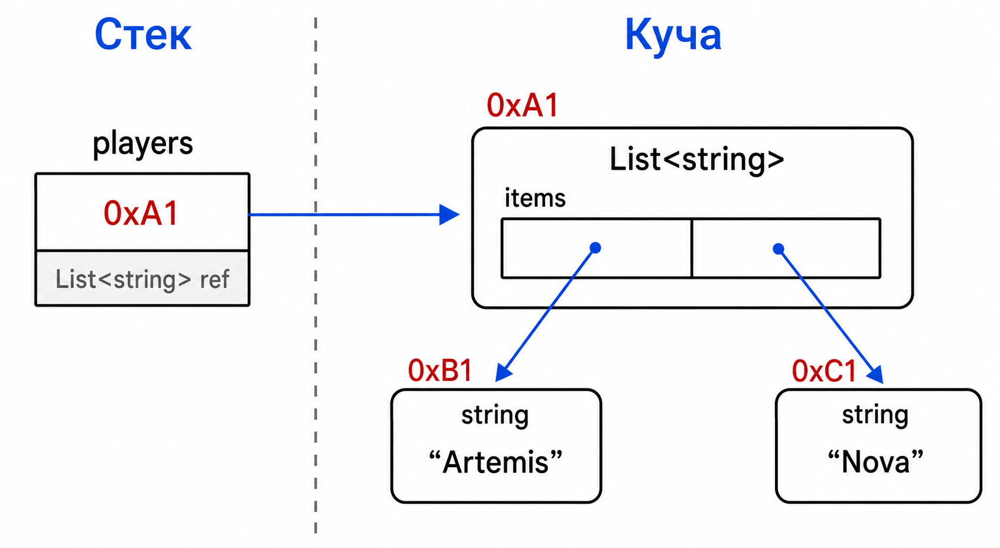

# Лекция 11: списки и словари

## Список

Массив имеет фиксированный размер. `List<T>` хранит последовательность элементов и может увеличивать внутренний массив при добавлении.

``` csharp
List<string> players = new List<string>();
players.Add("Artemis");
players.Add("Nova");

foreach (string player in players)
{
    Console.WriteLine(player);
}
```

Список удобен для последовательного обхода и вывода всех игроков.

## Как список устроен в памяти



При переполнении внутреннего массива `List` создаёт более вместительный массив и копирует элементы. Поэтому добавление обычно быстрое, но иногда вызывает заметную операцию расширения.

Поиск элемента по индексу в `List<T>` обычно занимает постоянное время, а поиск по значению проходит элементы последовательно. У словаря поиск по ключу в обычном случае тоже быстрый, но зависит от корректной работы хеширования и сравнения ключей. Это не магия и не гарантия для любого случая — просто другая внутренняя организация данных.

## Словарь

`Dictionary<TKey, TValue>` хранит пары ключ-значение и быстро находит значение по ключу.

``` csharp
Dictionary<string, int> levels = new Dictionary<string, int>();
levels["Artemis"] = 12;
levels["Nova"] = 8;

if (levels.TryGetValue("Artemis", out int level))
{
    Console.WriteLine(level);
}
```

Ключ должен быть уникальным. `TryGetValue` безопаснее прямого обращения, если ключ может отсутствовать.

Список и словарь часто используются вместе с классами:

``` csharp
Dictionary<string, Player> players = new Dictionary<string, Player>();
players["Artemis"] = new Player();
```

Словарь хранит ссылки на объекты `Player`. Удаление ключа удаляет ссылку из словаря, но сам объект будет освобождён только когда на него больше не останется ссылок.

## Ссылки на объекты

Список и словарь — объекты в куче. Переменные хранят ссылки на них. Внутри коллекций ссылочные элементы тоже представлены ссылками, а элементы-структуры лежат непосредственно во внутреннем массиве.

Коллекция не является копией объектов:

``` csharp
Player player = new Player();
List<Player> players = new List<Player> { player };
players[0].Level = 10;
Console.WriteLine(player.Level); // 10
```

В список добавилась ещё одна ссылка на тот же объект.

## Итог

`List<T>` хранит изменяемую последовательность, `Dictionary<TKey,TValue>` сопоставляет ключи и значения. Обе коллекции являются объектами в куче и управляют внутренними структурами данных.
