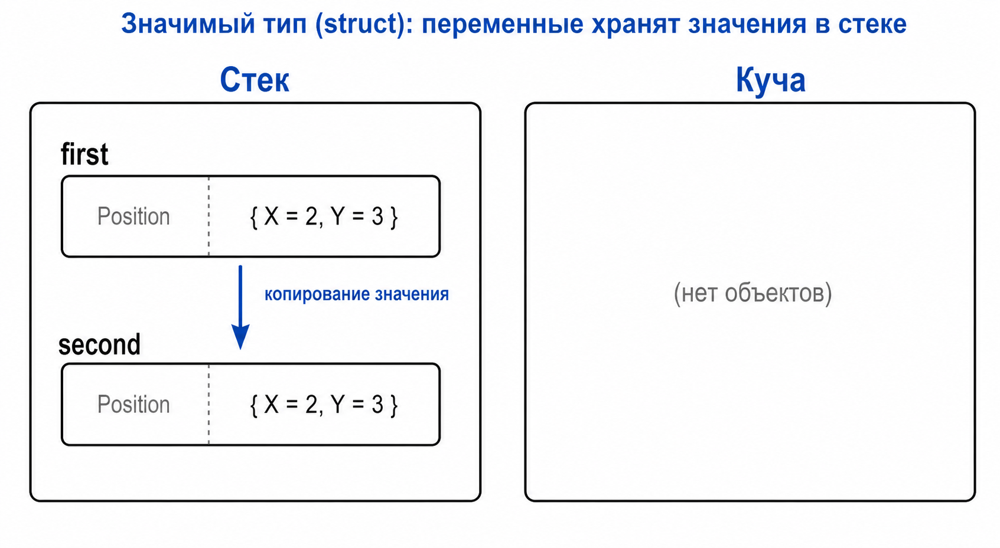

# Лекция 12: перегрузка операторов

## Оператор как метод

Для чисел `+` означает сложение. Для собственного типа можно определить, что именно значит этот оператор.

``` csharp
struct ItemStack
{
    public string Name;
    public int Count;

    public static ItemStack operator +(ItemStack left, ItemStack right)
    {
        if (left.Name != right.Name)
        {
            throw new InvalidOperationException("Предметы разные");
        }

        return new ItemStack { Name = left.Name, Count = left.Count + right.Count };
    }
}
```

Теперь две стопки камня можно объединить через `stack1 + stack2`. Оператор должен иметь очевидный смысл и не удивлять человека, читающего код.

## Другие операторы

Можно перегружать `-`, `==`, `!=` и другие операторы. Связанные операторы обычно реализуют согласованно: если определили `==`, нужно продумать и `!=`.

Сравнение стопок должно учитывать оба поля:

``` csharp
public static bool operator ==(ItemStack left, ItemStack right)
{
    return left.Name == right.Name && left.Count == right.Count;
}

public static bool operator !=(ItemStack left, ItemStack right)
{
    return !(left == right);
}
```

Перегрузка не отменяет проверок предметной области. Нельзя объединять разные предметы только потому, что это технически возможно. Если операция не имеет естественного смысла, лучше сделать обычный метод с говорящим именем.

``` csharp
ItemStack first = new ItemStack { Name = "Stone", Count = 25 };
ItemStack second = new ItemStack { Name = "Stone", Count = 40 };
ItemStack result = first + second;
```

## Память

`ItemStack` — структура, поэтому локальные значения обычно содержат поля непосредственно в своём хранилище. Результат `first + second` — новая копия структуры.



## Итог

Перегрузка операторов превращает операции предметной области в читаемый код, но пользоваться ею нужно только при естественном смысле операции.
