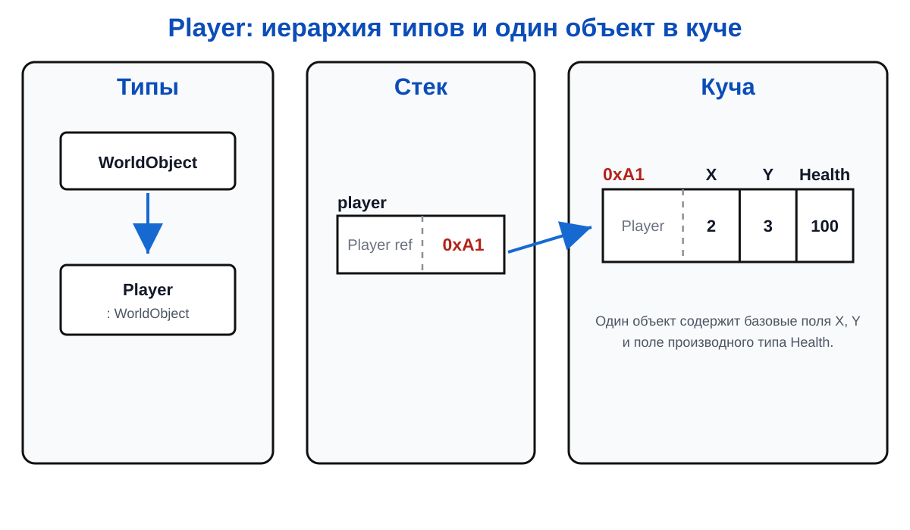

# Лекция 13: наследование и иерархия типов

## Общие и особенные свойства

Игрок, монстр и торговец являются объектами игрового мира. У всех есть координаты и имя, но действия различаются.

``` csharp
class WorldObject
{
    public int X;
    public int Y;
}

class Player : WorldObject
{
    public int Health;
}

Player player = new Player { X = 2, Y = 3, Health = 100 };
```

`Player` наследует поля `X` и `Y`, а также добавляет `Health`.

Так появляется иерархия:



Производный класс получает члены базового класса и может добавлять свои. Наследование не означает «скопировать исходный код»; это отношение типов, которое учитывается компилятором и runtime.

При создании наследника сначала выполняется конструктор базовой части, затем конструктор производного класса:

``` csharp
class WorldObject
{
    public WorldObject(int x, int y)
    {
        X = x;
        Y = y;
    }

    public int X;
    public int Y;
}

class Player : WorldObject
{
    public Player(int x, int y) : base(x, y)
    {
    }
}
```

`base(...)` передаёт параметры конструктору базового класса и помогает создать полностью корректный объект.

## Память наследника

Объект наследника содержит части базового и производного типа в одном объекте кучи.


Наследование не создаёт отдельный объект `WorldObject`, к которому ведёт вторая стрелка. Это один объект, просто его можно рассматривать через базовый тип.

## Upcast и downcast

``` csharp
WorldObject objectFromPlayer = player; // upcast: безопасно
Player samePlayer = (Player)objectFromPlayer; // downcast
```

Upcast поднимает объект к базовому типу. Downcast требует уверенности, что объект действительно является `Player`; иначе будет исключение. Для проверки используют `is` или pattern matching.

``` csharp
if (objectFromPlayer is Player foundPlayer)
{
    Console.WriteLine(foundPlayer.Health);
}
```

`as` тоже выполняет безопасное приведение и возвращает `null`, если тип не подходит:

``` csharp
Player foundPlayer = objectFromPlayer as Player;

if (foundPlayer != null)
{
    Console.WriteLine(foundPlayer.Health);
}
```

## Итог

Наследование строит иерархию «является». Объект остаётся одним объектом в куче, а ссылки разных типов дают разные доступные части его интерфейса.
