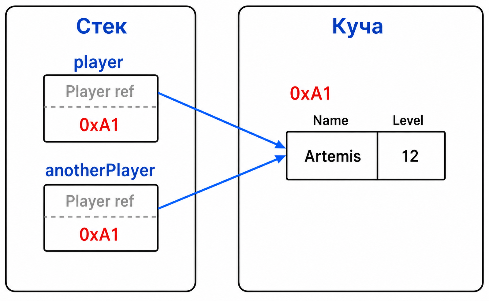

# Лекция 16: статические классы и методы расширения

## Статический метод

Статический метод принадлежит классу, а не конкретному объекту.

``` csharp
static class GameMath
{
    public static int Clamp(int value, int min, int max)
    {
        return Math.Max(min, Math.Min(value, max));
    }
}

int health = GameMath.Clamp(120, 0, 100);
```

Для вызова не нужен `new GameMath()`: у класса нет экземпляров.

Статический метод не получает скрытый параметр `this`, поэтому он не может напрямую обратиться к полям конкретного игрока. Все нужные данные должны прийти параметрами.

Статический метод не получает скрытый параметр `this`, поэтому он не может напрямую обратиться к полям конкретного игрока. Все нужные данные должны прийти параметрами.

## Статическое поле

Статическое поле одно на весь тип и общее для всех пользователей класса.

``` csharp
static class GameSettings
{
    public static int MaxStackSize = 999;
    public static int MapSize = 100;
}
```

Такое поле подходит для общей настройки. Состояние конкретного игрока статическим делать нельзя: тогда все игроки неожиданно получили бы одно и то же здоровье.

## Память статических данных

Статические данные живут вместе с типом до завершения процесса. Это не обычный кадр метода в стеке.



## Методы расширения

Метод расширения позволяет вызвать статический метод как будто он принадлежит существующему типу.

``` csharp
static class StringExtensions
{
    public static bool IsBlank(this string text)
    {
        return string.IsNullOrWhiteSpace(text);
    }
}

string playerName = "   ";
Console.WriteLine(playerName.IsBlank());
```

Ключевое слово `this` у первого параметра сообщает компилятору, для какого типа доступен вызов. На самом деле это всё ещё статический метод, а запись с точкой — удобный синтаксический сахар.

Метод расширения не может получить доступ к `private`-полям расширяемого класса. Он работает только с публичным интерфейсом, как обычный внешний метод.

Метод расширения не может получить доступ к `private`-полям расширяемого класса. Он работает только с публичным интерфейсом, как обычный внешний метод.

## Как выбрать инструмент

Обычный экземплярный метод использует состояние конкретного объекта. Статический метод выполняет общую операцию без объекта. Метод расширения подходит, когда операция логически относится к уже существующему типу и делает код читабельнее.

## Итог

Статические методы и поля принадлежат типу, а не экземпляру. Методы расширения улучшают синтаксис вызова, но не меняют устройство памяти и не превращают статический метод в настоящий метод объекта.
