- [Требования к структуре папок в репозитории](#требования-к-структуре-папок-в-репозитории)
- [Как пользоваться гитом](#как-пользоваться-гитом)
  - [Git GUI](#git-gui)
- [Подключить существующую папку к репозиторию](#подключить-существующую-папку-к-репозиторию)
  - [1. Создать пустой репозиторий в GitHub](#1-создать-пустой-репозиторий-в-github)
  - [2. Найти папку с проектом](#2-найти-папку-с-проектом)
  - [3. Подключить папку к git'у](#3-подключить-папку-к-gitу)
    - [3.1. Открыть папку в Fork](#31-открыть-папку-в-fork)
    - [3.2. Добавить Remote](#32-добавить-remote)
    - [3.3. gitignore](#33-gitignore)
    - [3.4. Синхронизировать локальный и удаленный репозитори](#34-синхронизировать-локальный-и-удаленный-репозитори)
- [Создать репу на GitHub и начать в ней работать](#создать-репу-на-github-и-начать-в-ней-работать)


# Требования к структуре папок в репозитории

```
CsLabs
├── sem-1-lab-02-server-config
|   ├── AnyProjectName
|   |   ├── Program.cs
|   |   └── AnyProjectName.csproj
|   ├── AnyProjectName.Tests
|   |   ├── Tests.cs
|   |   └── AnyProjectName.Tests.csproj
|   └── AnyProjectName.Tests
├── sem-1-lab-02-some-other
└── ...
```

* `CsLabs` - имя вашей папки с репозиторием, скорее всего будет именно таким, но именно это имя мне не важно
* `sem-1-lab-02-server-config` - фиксированное имя лабы. Смотреть на странице с самой лабой. Если его нет, то я его не добавил - попросите меня его задать. Не придумывайте отсебятину. Да, я настроил скрипт, что он в целом даже с полным несоответствием найдет, но будем считать это порверку на тех, кто умеет читатью
* `AnyProjectName`, `AnyProjectName.Tests` - как видно из названия называйте как хотите

> Мне важно соблюдение только имен лабораторных вида `sem-1-lab-02-server-config` и т.д. Точное имя смотрите для каждой лабораторной на ее странице.


# Как пользоваться гитом

Пользоваться гитом начнем не с самых первых пар, поэтому если заглянули сюда и не понимаете о чем речь, - не волнуйтесь, пока вы и не должны понимать.

## Git GUI

Для вызова команд гита можно пользоваться напрямую утилитой `git.exe`, либо [скачать любой на выбор графический интерфейс (GUI)](https://git-scm.com/tools/guis). 

На парах все примеры будут приводиться в программе [Fork](https://git-fork.com/). Она полностью бесплатна.

Выберите и скачайте любой понравившийся GUI.

# Подключить существующую папку к репозиторию

## 1. Создать пустой репозиторий в GitHub

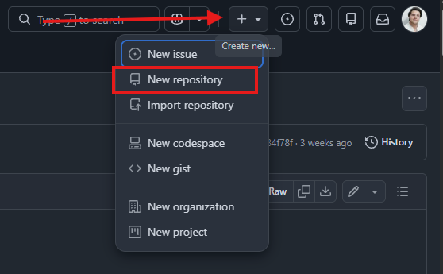

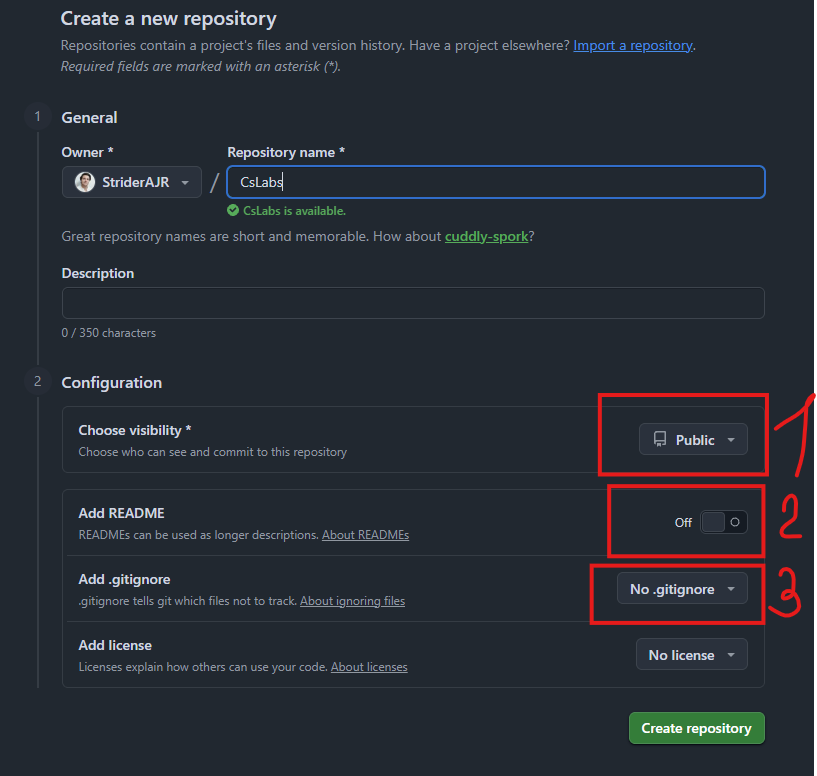

**ВАЖНО!** Раз у вас уже есть локальный репозиторий (файлы на компе),  то инициализировать при создании удаленный репозитоий для этого не нужно. Убедитесь, что у вас выключено создание Readme (2) и не выбран gitignore шаблон (3).

По желанию можете сделать репозиторий публичным (все его будут видеть) или приватным (тогда нужно будет меня добавить специально в правах доступа).

Нажимаем `Create repository`. Если все сделали правильно, то будет выглядеть так:
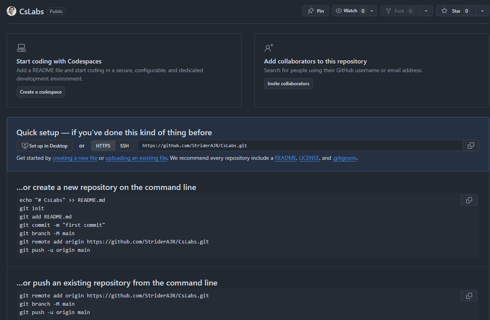

Если вы не видите инструкцию `Quick setup`, а видите список файлов (пусть даже с одним файлом Readme или .gitignore), то вы ошиблись при настройке нового репозитория. Лучше удалите этот и создайте заново.

## 2. Найти папку с проектом

У вас наверняка уже есть папка, в которой вы писали код по лабораторным. Теперь ее нужно будет подключить к системе контроля версий (git). 

Для этого сначала нужно найти эту папку в файловой системе. Из вашей IDE вы можете открыть папку.

ПКМ про solution и выберите Открыть папку в обозревателе файлов


Откроется папка с вашим проектом, нужно запомнить (или скопировать) путь до нее.


Убедитесь, что в открытой папке у вас есть файл с расширением `*.sln`. Нужна именно такая папка, потому что именно `sln` файл является точкой открытия всей вашего решения (solution). Не нужно ориентироваться на файл `Program.cs` - это один единственный файл с кодом, а их в проекте и решении может быть очень много.

Если вы не видите расширения файлов и скрытые папки, то включите в настройках показ скрытых файлов, папок и расширений файлов.

## 3. Подключить папку к git'у

### 3.1. Открыть папку в Fork

Теперь идем в Fork и открываем папку с проектом.

File -> Open Repository -> Выбираем путь до папки, где лежит sln файл


Fork резонно возмутится, что выбранная папка не является репозиторием (в ней нет скрытой папки `.git` и соответственно git в ней не инициализирован). 

На вопрос, что делать, отвечаем, что нужно проинициализировать репозиторий.


Теперь, если посмотреть, что поменялось в папке на диске, то увидим, что создалась скрытая папка `.git`. Значит папка проинициализирована как репозиторий git'а и git будет следить за состоянием файлов в этой папке.


Но это просто проинициализированный репозиторий в папке, он еще не подключен в уже созданному и хранящему на GitHub удаленному репозиторию.

### 3.2. Добавить Remote

Чтобы подключить локальный репозиторий в папке на диске с удаленным репозиторием на сервере, нужно в Fork добавить Remote - ссылку на удаленный репозиторий.

Сначала найдем ссылку на ваш репозиторий. Она есть на странице с созданным репозиторием.

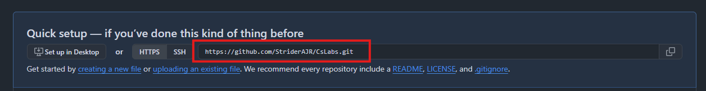

Теперь открываем Fork с открытым нашим репозиторием. ПКМ по Remotes -> Add new Remote...

Нужно скопировать в поле Repository Url ссылку на ваш репозиторий и нажать `Add New Remote`.

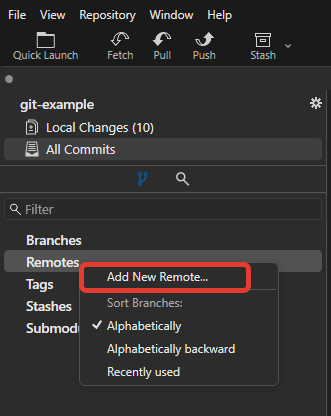

В панели слева появится значок GitHub с именем origin - вы добавили ссылку на удаленный репозиторий.


### 3.3. gitignore

Как говорилось на лекции, любая система контроля версий заточена под работу с текстовыми файлами. Но при компиляции ваших проектов создаются и бинарные файлы, за которыми гит следить построчно не может.

Каждое изменение такого файла - это удаление старого файла и добавление нового целиком. Это приведет к тому, что размер вашего репозитория (а репозиторий хранит не только текущее состояние файлов, но и все его предыдущие состояния) начнет быстро увеличиваться.

Чтобы такого не происходило нужно сказать git'у, чтобы он игнорировал определенные файлы и не следил за их состоянием.

Для настройки используется файл `.gitignore`, который нужно положить в корень репозитория. Обратите внимание на имя файла: точка gitignore. Именно так. Обязательно точка в начале и без опечаток слово gitignore.

Если имя файла будет не корректным, то git его просто не увидит и не начнет фильтровать ненужные файлы.

Шаблонов gitignore много, для разных типов проектов, IDE и т.д.

Можете [скачать мой файл](https://raw.githubusercontent.com/StriderAJR/StudentCs/refs/heads/main/code-examples/.gitignore) и положить его в корень своего репозитория.

### 3.4. Синхронизировать локальный и удаленный репозитори

Теперь нужно заставить Fork синхронизировать состояние вашего локального репозитория с удаленным. Т.к. файлы у вас на компе есть, а в удаленном репозитории нет, то сначала сделаем первый коммит.

Перейдите в Local changes, там будут файлы, доступные для коммита.

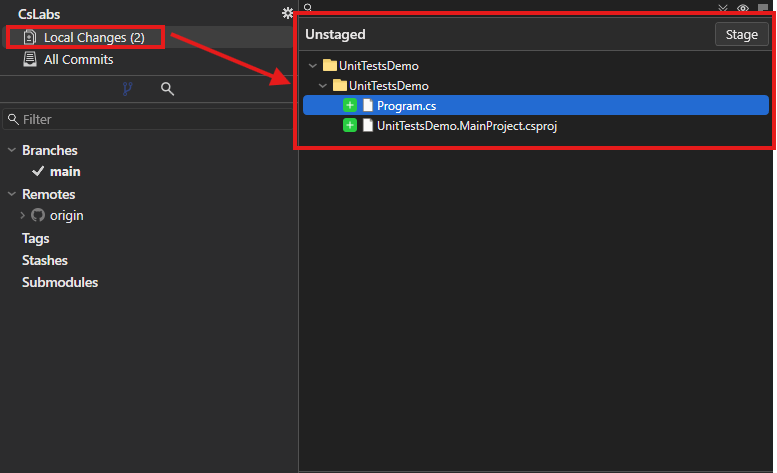

Если вы правильно настроили gitignore, то там будет не так много файлов: только cs, csproj и sln файлы.

Выделите все файлы и жмакайте Stage.

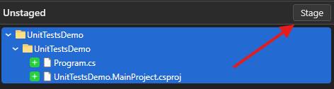

Файлы прыгнут в нижнее окно Staged.

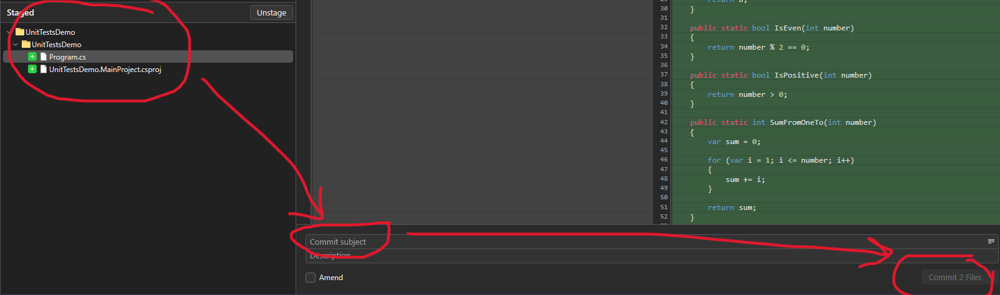

Введите какое-то сообщение в поле с сообщением, и нажимайте `Commit`.

На странице с коммитами появится ваш коммит. Осталось нажать `Push`, чтобы отправить ваши изменения на удаленный сервер.

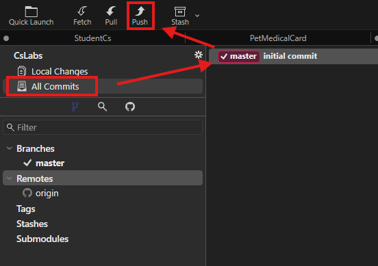

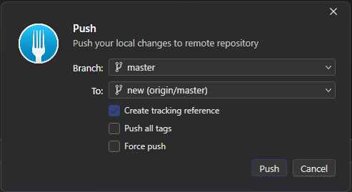

Мы подключили папку к гиту. Зачок GitHub в дереве коммитов стоит на нашей последней версии.

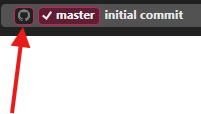

# Создать репу на GitHub и начать в ней работать

Если вы еще не писали лабораторные, которые нужно заливать через git, то можно сначала создать репозиторий на GitHub и склонировать его локально.

Тогда при создании репозитория в gitignore выбирайте шаблон VisualStudio (или другой под вашу IDE)

А в Fork нужно уже не открывать репозиторий, а клонировать его. Fork подскажет что и как делать.

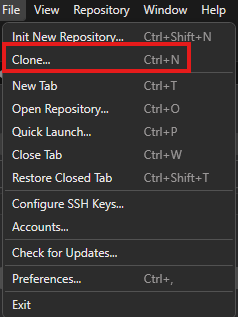

После этого просо создавайте внутри созданной папки с репой папки для лаб и уже в них создавайте проекты.