# Как пользоваться гитом

Для каждого из вас создан проект (это репозиторий в терминах GitLab), в котором вы будете выполнять лабораторные работы. Вам должно было прийти приглашение на почту, которое нужно принять.

После принятия приглашения после входа в gitlab и переходе в раздел с проектами

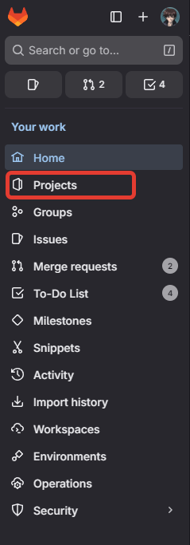

вы увидите свой проект на вкладке с Personal, Contributed или Members

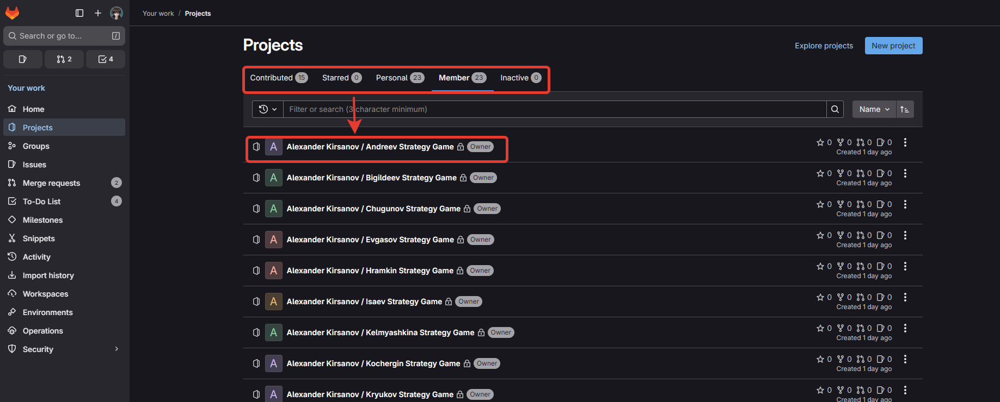

## Git GUI

Для вызова команд гита можно пользоваться напрямую утилитой `git.exe`, либо [скачать любой на выбор графический интерфейс (GUI)](https://git-scm.com/tools/guis). 

На парах все примеры будут приводиться в программе [Fork](https://git-fork.com/). Она полностью бесплатна.

Выберите и скачайте любой понравившийся GUI.

## Подключить существующую папку к репозиторию

### Найти папку с проектом

У вас наверняка уже есть папка, в которой вы писали код по лабораторным. Теперь ее нужно будет подключить к системе контроля версий (git). 

Для этого сначала нужно найти эту папку в файловой системе. Из вашей IDE вы можете открыть папку.

ПКМ про solution и выберите Открыть папку в обозревателе файлов

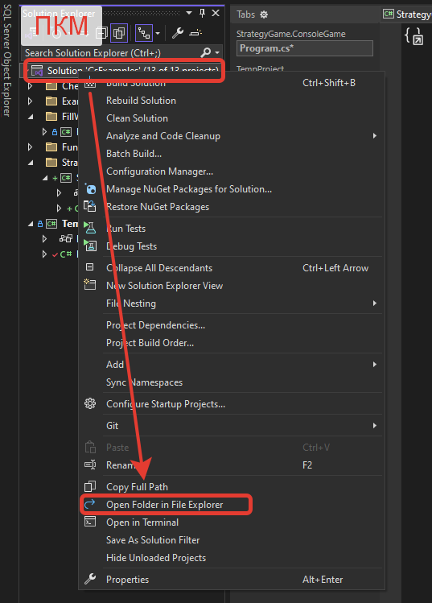

Откроется папка с вашим проектом, нужно запомнить (или скопировать) путь до нее.

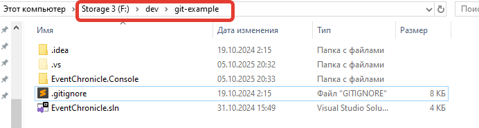

Убедитесь, что в открытой папке у вас есть файл с расширением `*.sln`. Нужна именно такая папка, потому что именно `sln` файл является точкой открытия всей вашего решения (solution). Не нужно ориентироваться на файл `Program.cs` - это один единственный файл с кодом, а их в проекте и решении может быть очень много.

Если вы не видите расширения файлов и скрытые папки, то включите в настройках показ скрытых файлов, папок и расширений файлов.

### Подключить папку к git'у

Теперь идем в Fork и открываем папку с проектом.

File -> Open Repository -> Выбираем путь до папки, где лежит sln файл

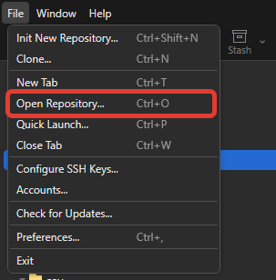

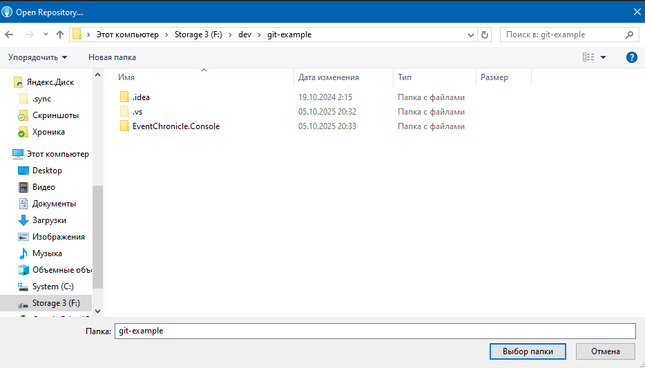

Fork резонно возмутится, что выбранная папка не является репозиторием (в ней нет скрытой папки `.git` и соответственно git в ней не инициализирован). 

На вопрос, что делать, отвечаем, что нужно проинициализировать репозиторий.

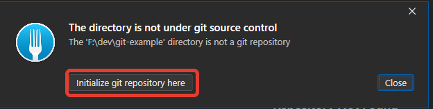

Теперь, если посмотреть, что поменялось в папке на диске, то увидим, что создалась скрытая папка `.git`. Значит папка проинициализирована как репозиторий git'а и git будет следить за состоянием файлов в этой папке.

Но это просто проинициализированный репозиторий в папке, он еще не подключен в уже созданному и хранящему на GitLab удаленному репозиторию.

Чтобы подключить локальный репозиторий в папке на диске с удаленным репозиторием на сервере, нужно в Fork добавить Remote - ссылку на удаленный репозиторий.

Сначала найдем ссылку на ваш репозиторий. Открывайте ваш проект на сайте GitLab.

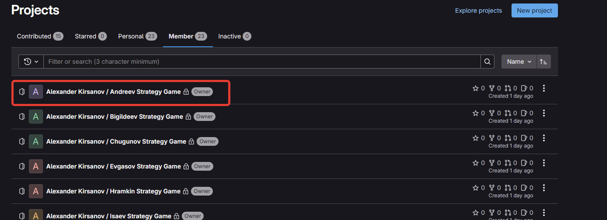

Откроется страница с вашим проектом. На ней есть кнопка `Code`, под ней прячутся ссылки на ваш репозиторий. Скопируйте HTTPS ссылку (лдя SSH нужно настраивать сертификаты, ключи и т.д., https нам будет достаточно).

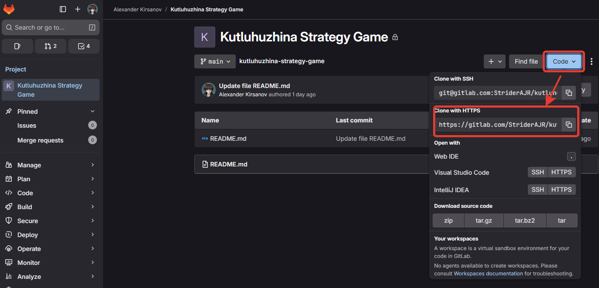

Теперь открываем Fork с открытым нашим репозиторием. ПКМ по Remotes -> Add new Remote...

Нужно скопировать в поле Repository Url ссылку на ваш репозиторий и нажать `Add New Remote`.

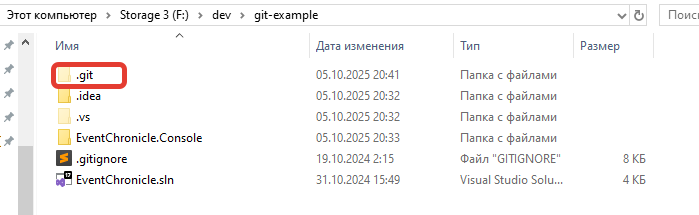

В панели слева появится значок GitLab с именем origin - вы добавили ссылку на удаленный репозиторий.

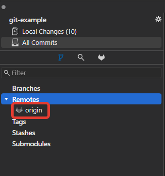

Но это просто ссылка. Теперь нужно заставить Fork скачать имеющуюся на сервер информацию к вам на диск. Нажимаем кнопку `Fetch`

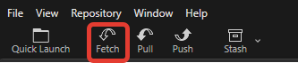

Когда команда Fetch завершится, то в выпадающем списке origin вы увидите, что подтянулась ветка `main`

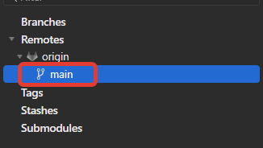

Дважды кликните на ветку, чтобы выкачать ее с сервера к вам на диск. Появится окно, в нем нажмите `Track` - связать вашу локальную ветку и удаленную на сервере. 

Ветка появится в секции `Branches` - это ваши локальные скачанные ветки.

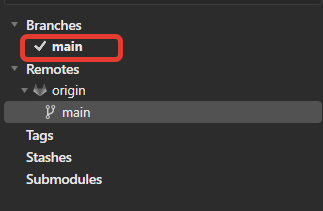

Мы подключили папку к гиту. Теперь нужно залить ваши созданные ранее файлы в удаленный репозиторий

### gitignore

Как говорилось на лекции, любая система контроля версий заточена под работу с текстовыми файлами. Но при компиляции ваших проектов создаются и бинарные файлы, за которыми гит следить построчно не может.

Каждое изменение такого файла - это удаление старого файла и добавление нового целиком. Это приведет к тому, что размер вашего репозитория (а репозиторий хранит не только текущее состояние файлов, но и все его предыдущие состояния) начнет быстро увеличиваться.

Чтобы такого не происходило нужно сказать git'у, чтобы он игнорировал определенные файлы и не следил за их состоянием.

Для настройки используется файл `.gitignore`, который нужно положить в корень репозитория. Обратите внимание на имя файла: точка gitignore. Именно так. Обязательно точка в начале и без опечаток слово gitignore.

Если имя файла будет не корректным, то git его просто не увидит и не начнет фильтровать ненужные файлы.

Шаблонов gitignore много, для разных типов проектов, IDE и т.д.

Можете [скачать мой файл](https://gitlab.com/StriderAJR/StudentCs/-/blob/main/code-examples/.gitignore?ref_type=heads) и положить его в корень своего репозитория.

### Push изменений

В учебных целях ветка main защищена - в нее нельзя напрямую пушить и мержить. Работать нужно через Merge Request, который я буду проверять.

Краткая последовательность действий, если вам нужно внести изменения в репозиторий (сейчас нам нужно залить новые файлы):
1. Создаем новую ветку, в которой будем фиксировать изменения
1. Переключаемся на созданную ветку
1. Stage всех нужных для коммита файлов
1. Коммит файлов
1. Push новой ветки
1. Создаем Merge Request на GitLab

А теперь на примере Fork и вашего проекта.

Создаем новую ветку. Даем ей более-менее вменяемое название, например, `new-project`.

ПКМ по локальной ветке main -> New branch...

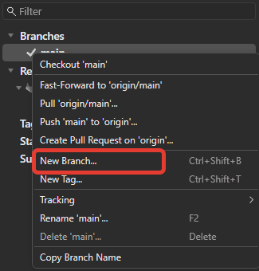

Вводим имя новой ветки. Можно поставить галочку `checkout after create`, чтобы после создания сразу переключиться на ветку.

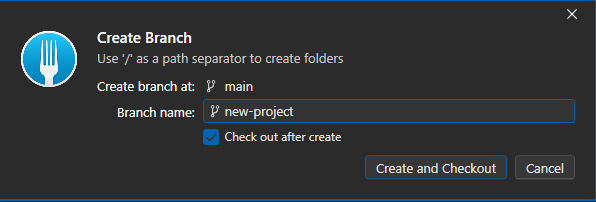

Теперь в списке ваших веток появилась новая ветка и напротив нее стоит галочка - значит, в данный момент в вашей файловой системе выкачана именно эта ветка.

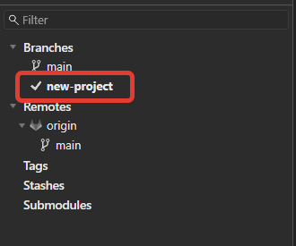

Идем в Local Changes, в которых видны все изменения в файлах репозитория

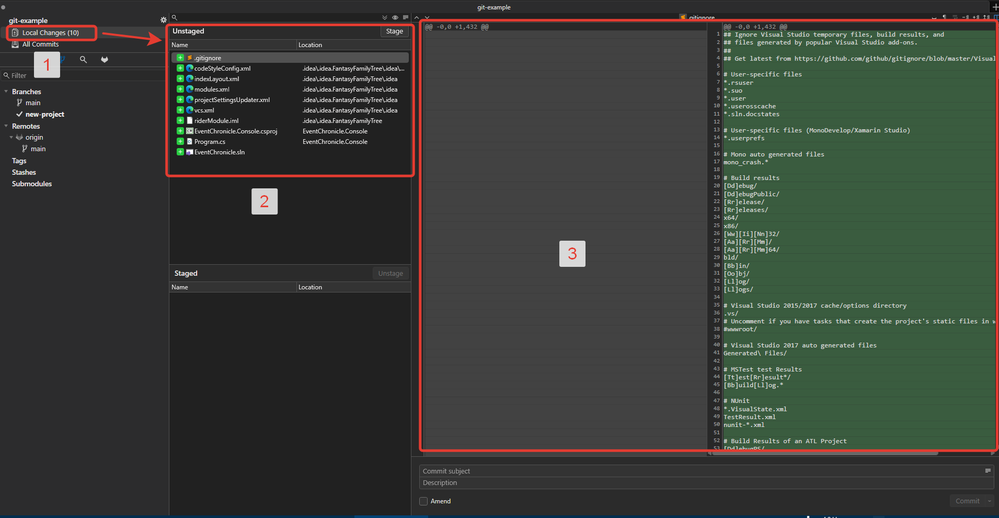

При переходе в Local Changes (1) откроются панели со списком измененных файлов (2) и при выборе файла в панеле (3) будет открываться сравнение старого состояния файла и новое.

Т.к. мы добавляем ранее не существовавшие файлы, то слева (в старом состоянии) файла ничего не будет.

Также если вы все сделали правильно, то в списке Unstaged файлов будут только файлы sln, csproj, cs и т.д. Но не будет bin, exe, dll и т.д. файлов. Если вы видите в списке бинарные файлы, то git не нашел файл .gitignore. Вернитесь назад и проверьте, что сделали всё по инструкции.

Если все верно, то выделяйте все unstaged файлы и нажимайте Stage. Состояние файла Stage означает, что именно эти изменения вы хотите зафиксировать в коммите (новой версии) репозитория. Иногда нужно закоммитить не все файлы, а только выборочные. Тогда нужно выделять и делать Stage только нужных файлов.

Вводим текст сообщения для коммита и нажимает кнопку Commit.

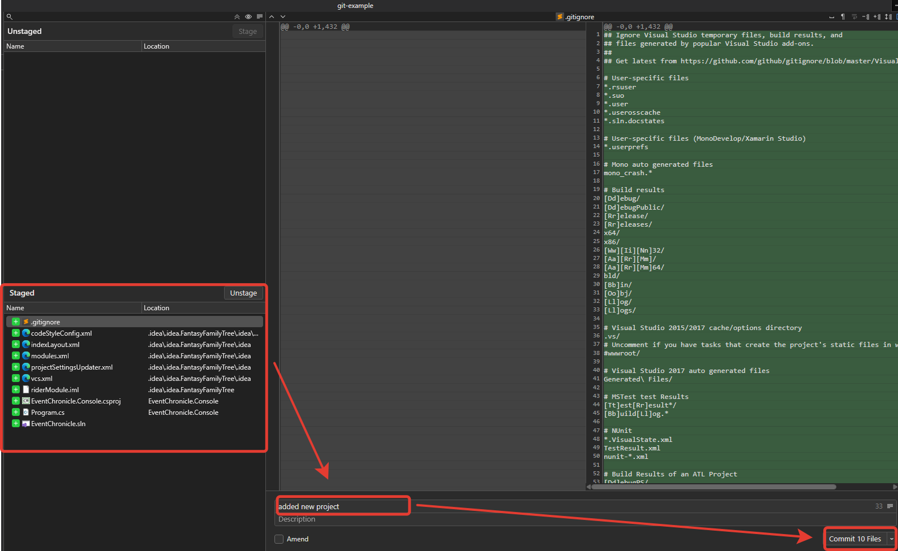

Если вернуться на вкладку All Commits, то в дереве коммитов вы увидите свой созданный коммит

Если выбрать коммит в списке, то внизу откроется панель с информацией о коммите, включая список измененных файлов.

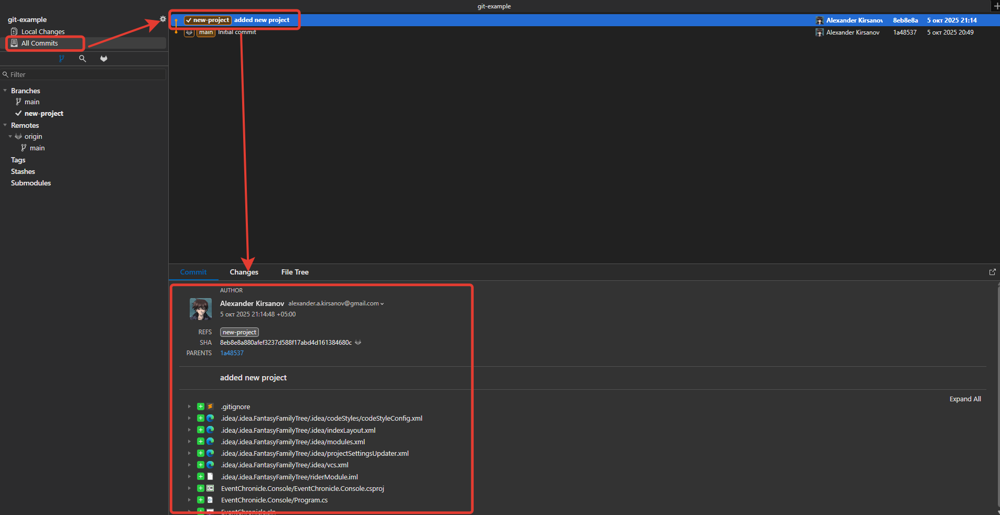

Если бы ветка main не была бы защищена, то мы могли бы сразу сделать merge ветки new-project в ветку main. Но из-за защиты этого сделать нельзя - сначала нужно пройти процедуру code review с преподавателем, чтобы ваши изменения сначала оценили и при необходимости подкорректировали и только потом изменения можно будет влить в main.

В Fork можно сразу пушнуть новую ветку и создать Pull Request.

Возвращаемся в ветку main (дважды по ней кликните, чтобы она выбралась и появилась галочка рядом с ней). Не пугайтесь, если на этом шаге посмотрите в папку на вашем диске и не увидите файлов с программой - они существуют только в ветке new-project, в ветке main их нет - ветка пока что пуста.

Теперь с выкачанной main веткой делаем ПКМ по ветке, которую хотим влить (new-project) и выбираем `Push and Create Pull Request`

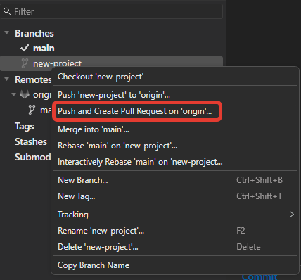

Fork выполнит push - отправку локальных изменений на сервер и дернет GitLab, чтобы создался Pull Request. Откроется страница в браузере

(1) впишите краткое название вашего Pull Request'а. Например, "залил первую лабу", "добавил проект" и т.д.
(2) опишите, какие были изменения. Например,
в первой лабе сделал хождение игрока кнопками wasd
из второй лабы сделал только хранение карты в файле
(3) кто ответственен за Pull Request. Выбирайте "Assign to me", т.е. вы будете отвечать за пулл реквест и редактировать его по необходимости
(4) ревьюер - выбираете того, кто будет проверять ваш PR, т.е. меня.

При желании можете убрать галочку "Delete source branch after merge", чтобы ваша ветка после мержа не удалилась (например, если вы не хотите потом создавать новую ветку, а хотите продолжить в этой же).

И нажимайте "create merge request".

### PR Code review

Первый ваш PR с файлами я автоматически апрувну и сделаю Merge, чтобы ваши файлы появились в ветке main.

Но в дальнейшем процедура code review (т.е. оценивание вашей лабораторной) будет выглядеть так:
1. вы работаете в отдельной ветке, выполняя лабораторную
1. когда вы считаете, что все готово, то создаете PR, который прилетит мне на проверку
1. при необходимости я оставляю свои замечания на исправления
1. когда все замечания будут исправлены, я ставлю свой approve и вливаю ваш PR в ветку main

Из-за ограничений бесплатной версии GitLab вы можете влить изменения и без моего апрува. Но просьба так не делать без веской причины, чтобы обегчить мою проверку ваших работ.

В идеале, вы и не могли бы влить изменения без апрува. Но что имеем, то имеем.

Вот в такой формате и будем работать до конца курса.